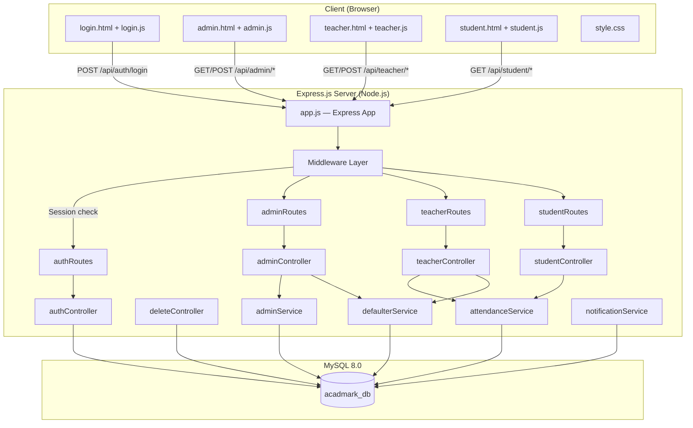
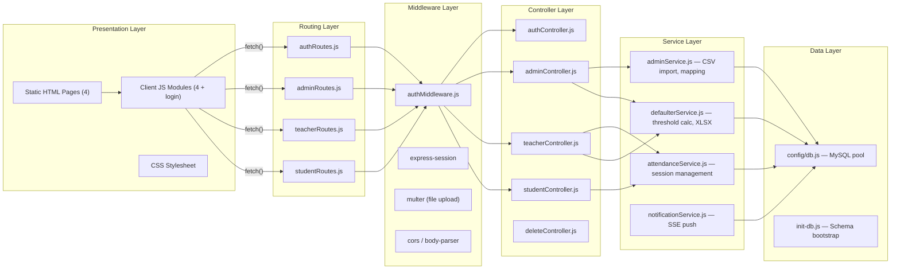
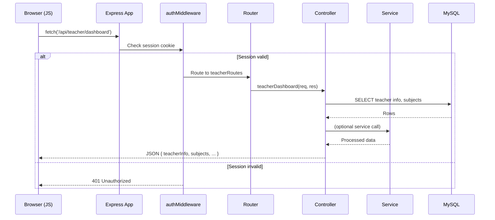
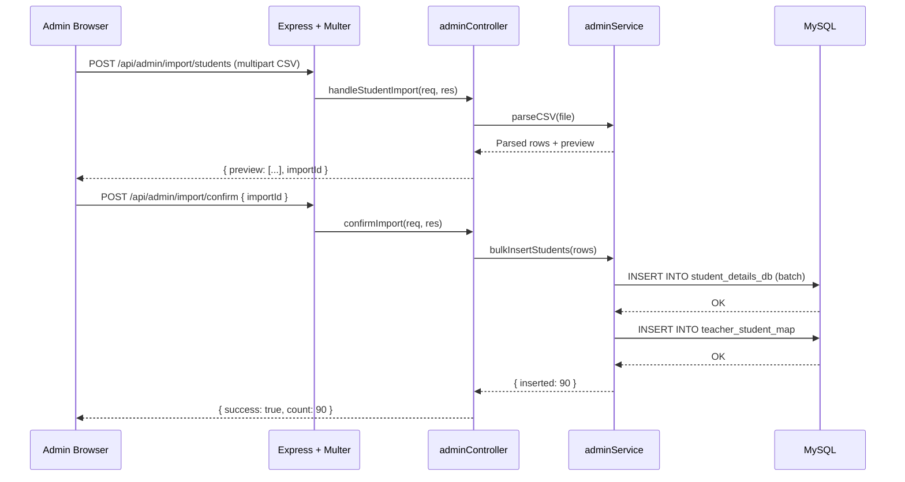
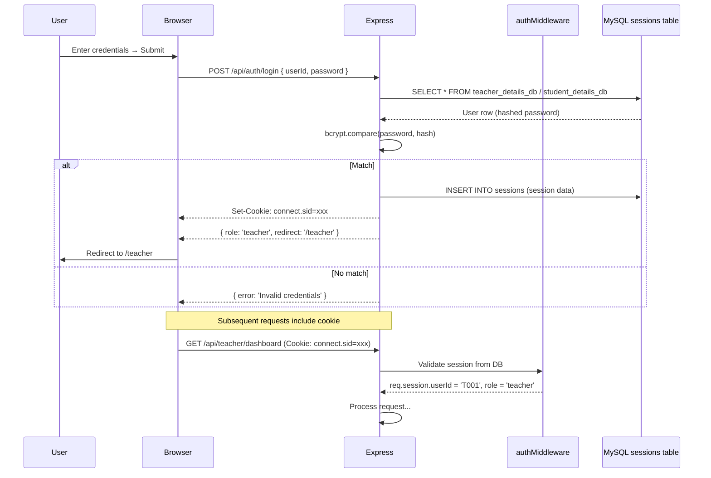
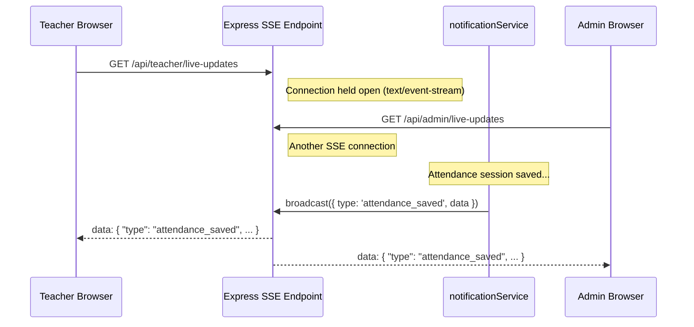
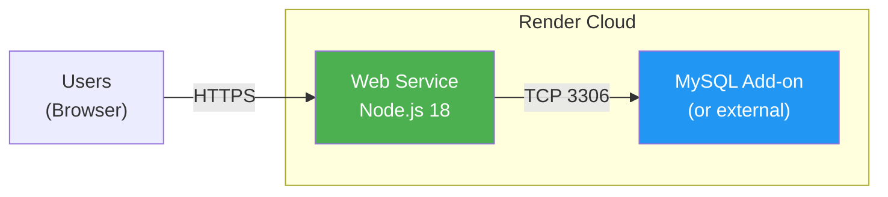

# System Architecture — AcadMark

## Student Attendance Management System

---

## Table of Contents

1. [Architecture Overview](#1-architecture-overview)
2. [High-Level Architecture Diagram](#2-high-level-architecture-diagram)
3. [Component Diagram](#3-component-diagram)
4. [Folder Structure](#4-folder-structure)
5. [API Endpoint Reference](#5-api-endpoint-reference)
6. [Request–Response Flow](#6-requestresponse-flow)
7. [Authentication & Session Flow](#7-authentication--session-flow)
8. [Real-Time Updates (SSE)](#8-real-time-updates-sse)
9. [Deployment Architecture](#9-deployment-architecture)
10. [Technology Stack](#10-technology-stack)

---

## 1. Architecture Overview

AcadMark follows a **three-tier monolithic architecture**:

| Tier             | Technology                      | Responsibility                                            |
| ---------------- | ------------------------------- | --------------------------------------------------------- |
| **Presentation** | HTML5, CSS3, Vanilla JavaScript | UI rendering, form handling, AJAX calls                   |
| **Application**  | Node.js + Express.js (ESM)      | REST API, business logic, authentication, file generation |
| **Data**         | MySQL 8.0 (InnoDB)              | Persistent storage, relational queries, session store     |

Key architectural decisions:

- **No frontend framework** — Vanilla JS with fetch API for simplicity and performance.
- **Server-rendered HTML pages** served as static files, with dynamic data fetched via JSON APIs.
- **MVC-inspired layering**: Routes → Controllers → Services → Database.
- **Session-based auth** with `express-session` backed by MySQL (`express-mysql-session`).

---

## 2. High-Level Architecture Diagram



---

## 3. Component Diagram



---

## 4. Folder Structure

```
acadmark/
├── server.js                    # Entry point — loads app.js & starts HTTP server
├── init-db.js                   # Database initialisation & schema migrations
├── package.json                 # Dependencies & npm scripts
├── Procfile                     # Heroku/Render process declaration
├── render.yaml                  # Render deployment config
├── Dockerfile                   # Docker container build
│
├── config/
│   └── db.js                    # MySQL connection pool (mysql2/promise)
│
├── src/
│   ├── app.js                   # Express application setup, middleware, route mounting
│   ├── controllers/
│   │   ├── authController.js    # Login, logout, session management
│   │   ├── adminController.js   # Dashboard stats, import, history, defaulters
│   │   ├── teacherController.js # Dashboard, attendance, defaulters, export
│   │   ├── studentController.js # Dashboard, calendar, session queries
│   │   └── deleteController.js  # Cascade delete utilities
│   ├── middlewares/
│   │   └── authMiddleware.js    # Session validation, role-based guards
│   ├── routes/
│   │   ├── authRoutes.js        # POST /login, /logout
│   │   ├── adminRoutes.js       # /api/admin/* (29 endpoints)
│   │   ├── teacherRoutes.js     # /api/teacher/* (21 endpoints)
│   │   └── studentRoutes.js     # /api/student/* (7 endpoints)
│   ├── services/
│   │   ├── adminService.js      # CSV parsing, bulk insert, auto-mapping
│   │   ├── attendanceService.js # Session lifecycle, record insertion
│   │   ├── defaulterService.js  # Threshold queries, XLSX generation
│   │   └── notificationService.js # SSE client management, broadcast
│   └── utils/                   # Shared utility functions
│
├── public/
│   ├── css/
│   │   └── style.css            # Global stylesheet
│   ├── js/
│   │   ├── login.js             # Login page logic
│   │   ├── admin.js             # Admin dashboard logic
│   │   ├── teacher.js           # Teacher dashboard logic
│   │   ├── student.js           # Student dashboard logic
│   │   └── main.js              # Shared utilities
│   └── templates/
│       ├── students_template.csv
│       └── teachers_template.csv
│
├── views/
│   ├── login.html               # Login page
│   ├── admin.html               # Admin dashboard
│   ├── teacher.html             # Teacher dashboard
│   └── student.html             # Student dashboard
│
├── uploads/                     # Temporary file upload directory
│
└── docs/                        # Project documentation (this folder)
```

---

## 5. API Endpoint Reference

### 5.1 Authentication (`/api/auth`)

| Method | Path               | Controller | Description                       |
| ------ | ------------------ | ---------- | --------------------------------- |
| POST   | `/api/auth/login`  | `login`    | Authenticate user, create session |
| POST   | `/api/auth/logout` | `logout`   | Destroy session, redirect         |

### 5.2 Admin (`/api/admin`)

| Method | Path                               | Controller                           | Description                   |
| ------ | ---------------------------------- | ------------------------------------ | ----------------------------- |
| GET    | `/dashboard`                       | `fetchDashboardStats`                | Aggregate statistics          |
| GET    | `/stats`                           | `fetchDashboardStats`                | Alias for dashboard           |
| GET    | `/activity`                        | `fetchImportActivity`                | Recent import activity log    |
| POST   | `/import/students`                 | `handleStudentImport`                | Upload student CSV/XLSX       |
| POST   | `/import/teachers`                 | `handleTeacherImport`                | Upload teacher CSV/XLSX       |
| POST   | `/import/confirm`                  | `confirmImport`                      | Confirm staged import         |
| GET    | `/import/preview`                  | `getImportPreview`                   | Preview staged import data    |
| GET    | `/templates/:type`                 | `downloadTemplate`                   | Download CSV template         |
| GET    | `/attendance/history`              | `getAttendanceHistory`               | List all attendance backups   |
| GET    | `/attendance/backup/:id`           | `downloadAttendanceBackup`           | Download backup as XLSX       |
| GET    | `/attendance/session/:id`          | `getSessionStudents`                 | View session student list     |
| DELETE | `/attendance/session/:id`          | `deleteAttendanceSession`            | Delete a session              |
| POST   | `/attendance/clear-history`        | `clearAttendanceHistory`             | Clear all attendance history  |
| POST   | `/delete-all-data`                 | `deleteAllData`                      | Full system data reset        |
| POST   | `/auto-map-students`               | `triggerAutoMapping`                 | Auto-map students to teachers |
| GET    | `/defaulters`                      | `getDefaulterList`                   | Generate defaulter list       |
| GET    | `/defaulters/download`             | `downloadDefaulterList`              | Export defaulters as XLSX     |
| GET    | `/defaulters/history`              | `getAdminDefaulterHistory`           | List all defaulter history    |
| GET    | `/defaulters/history/:id`          | `viewAdminDefaulterHistoryEntry`     | View a saved defaulter list   |
| GET    | `/defaulters/history/:id/download` | `downloadAdminDefaulterHistoryEntry` | Download saved list as XLSX   |
| DELETE | `/defaulters/history/:id`          | `deleteAdminDefaulterHistoryEntry`   | Delete a history entry        |
| GET    | `/teachers-info`                   | `getTeachersInfo`                    | All teacher assignments       |
| GET    | `/students`                        | `getStudentsByFilters`               | Students with filters         |
| GET    | `/students-info`                   | `getStudentsInfo`                    | Student listing               |
| GET    | `/streams-divisions`               | `getStreamsDivisions`                | Available streams & divisions |
| GET    | `/teacher-divisions`               | `getTeacherDivisions`                | Divisions per teacher         |
| GET    | `/student-divisions`               | `getStudentDivisions`                | Student-based divisions       |
| GET    | `/teacher-streams`                 | `getTeacherStreams`                  | Teacher-based streams         |

### 5.3 Teacher (`/api/teacher`)

| Method | Path                               | Controller                      | Description                     |
| ------ | ---------------------------------- | ------------------------------- | ------------------------------- |
| GET    | `/dashboard`                       | `teacherDashboard`              | Teacher overview & subject list |
| GET    | `/students`                        | `mappedStudents`                | Students for selected class     |
| GET    | `/students/present`                | `getStudentsPresent`            | Currently present students      |
| GET    | `/streams`                         | `getStreamsAndDivisions`        | Streams & divisions for teacher |
| GET    | `/subjects`                        | `getSubjectsForClass`           | Subjects for a class config     |
| POST   | `/attendance/start`                | `startAttendance`               | Begin attendance session        |
| POST   | `/attendance/end`                  | `endAttendance`                 | Finalize session                |
| POST   | `/attendance/manual`               | `manualAttendance`              | Manual one-off marking          |
| GET    | `/activity`                        | `teacherActivityLog`            | Teacher's activity log          |
| POST   | `/attendance/backup`               | `saveAttendanceBackup`          | Save session backup             |
| GET    | `/attendance/history`              | `getAttendanceHistory`          | Teacher's session history       |
| POST   | `/attendance/delete-history`       | `deleteAttendanceHistory`       | Delete a history entry          |
| POST   | `/attendance/bulk-delete-history`  | `bulkDeleteAttendanceHistory`   | Bulk delete history             |
| GET    | `/attendance/backup/:id/view`      | `viewAttendanceBackup`          | View backup details             |
| GET    | `/attendance/backup/:id`           | `downloadAttendanceBackup`      | Download backup as XLSX         |
| POST   | `/attendance/export-excel`         | `exportAttendanceExcel`         | Export current session XLSX     |
| GET    | `/defaulters`                      | `teacherGetDefaulterList`       | Generate teacher defaulters     |
| GET    | `/defaulters/download`             | `teacherDownloadDefaulterList`  | Export as XLSX                  |
| POST   | `/defaulters/history`              | `saveDefaulterHistory`          | Save defaulter list             |
| GET    | `/defaulters/history`              | `getDefaulterHistory`           | Teacher's defaulter history     |
| GET    | `/defaulters/history/:id`          | `viewDefaulterHistoryEntry`     | View saved defaulter list       |
| GET    | `/defaulters/history/:id/download` | `downloadDefaulterHistoryEntry` | Download saved list XLSX        |
| DELETE | `/defaulters/history/:id`          | `deleteDefaulterHistoryEntry`   | Delete defaulter history entry  |
| GET    | `/live-updates`                    | _(inline SSE)_                  | Server-Sent Events stream       |

### 5.4 Student (`/api/student`)

| Method | Path                   | Controller              | Description                 |
| ------ | ---------------------- | ----------------------- | --------------------------- |
| GET    | `/dashboard`           | `studentDashboard`      | Attendance stats & overview |
| POST   | `/attendance/mark`     | `markAttendance`        | _(reserved)_                |
| GET    | `/activity`            | `studentActivity`       | Student's activity feed     |
| GET    | `/sessions/all`        | `getAllSessions`        | All sessions with status    |
| GET    | `/sessions/present`    | `getPresentSessions`    | Sessions where present      |
| GET    | `/sessions/absent`     | `getAbsentSessions`     | Sessions where absent       |
| GET    | `/attendance/calendar` | `getAttendanceCalendar` | Monthly calendar data       |

---

## 6. Request–Response Flow

### 6.1 Typical API Request Lifecycle



### 6.2 File Import Flow



---

## 7. Authentication & Session Flow



### Session Configuration

```javascript
app.use(
  session({
    key: "acadmark_session",
    secret: process.env.SESSION_SECRET,
    store: new MySQLStore({
      /* pool config */
    }),
    resave: false,
    saveUninitialized: false,
    cookie: {
      maxAge: 24 * 60 * 60 * 1000, // 24 hours
      httpOnly: true,
      secure: process.env.NODE_ENV === "production",
    },
  }),
);
```

---

## 8. Real-Time Updates (SSE)



### SSE Implementation Pattern

```javascript
// In route handler
router.get("/live-updates", (req, res) => {
  res.writeHead(200, {
    "Content-Type": "text/event-stream",
    "Cache-Control": "no-cache",
    Connection: "keep-alive",
  });

  const clientId = Date.now();
  notificationService.addClient(clientId, res);

  req.on("close", () => {
    notificationService.removeClient(clientId);
  });
});
```

---

## 9. Deployment Architecture

### 9.1 Production Deployment (Render)



### 9.2 Docker Deployment

```dockerfile
FROM node:18-alpine
WORKDIR /app
COPY package*.json ./
RUN npm ci --production
COPY . .
EXPOSE 3000
CMD ["node", "server.js"]
```

### 9.3 Environment Variables

| Variable         | Example         | Description            |
| ---------------- | --------------- | ---------------------- |
| `PORT`           | `3000`          | HTTP server port       |
| `DB_HOST`        | `localhost`     | MySQL host             |
| `DB_USER`        | `root`          | MySQL user             |
| `DB_PASSWORD`    | `••••`          | MySQL password         |
| `DB_NAME`        | `acadmark_db`   | Database name          |
| `SESSION_SECRET` | `random-string` | Session encryption key |
| `NODE_ENV`       | `production`    | Environment flag       |

---

## 10. Technology Stack

| Layer             | Technology            | Version | Purpose                       |
| ----------------- | --------------------- | ------- | ----------------------------- |
| **Runtime**       | Node.js               | 18+     | Server-side JavaScript        |
| **Framework**     | Express.js            | 4.18+   | HTTP routing & middleware     |
| **Database**      | MySQL                 | 8.0+    | Relational data storage       |
| **DB Driver**     | mysql2/promise        | 3.x     | Async MySQL client            |
| **Session Store** | express-mysql-session | 3.x     | Server-side sessions in MySQL |
| **Auth**          | bcrypt                | 5.x     | Password hashing              |
| **File Upload**   | multer                | 1.4+    | Multipart form handling       |
| **Excel Export**  | exceljs               | 4.x     | XLSX file generation          |
| **CSV Parsing**   | csv-parser            | 3.x     | CSV file reading              |
| **Real-time**     | SSE (native)          | —       | Server-Sent Events            |
| **Frontend**      | Vanilla JS            | ES6+    | Client-side interactivity     |
| **Styling**       | CSS3                  | —       | Layout & theming              |
| **Dev Tool**      | nodemon               | 3.x     | Auto-restart on changes       |
| **Environment**   | dotenv                | 16.x    | .env file loading             |

---

_Document prepared by **Mohammed Sirajuddin Khan** (Backend Developer) and **Hinal Diwani** (Frontend Developer) under the supervision of **Yash Mane** (Project Lead)._