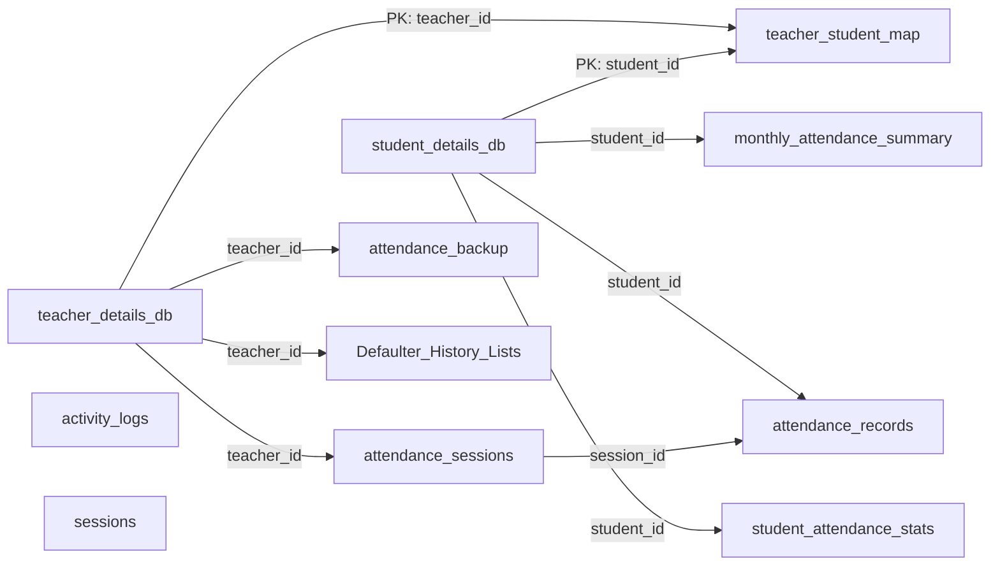

# Database Design — AcadMark

## Student Attendance Management System

| Field | Detail |
|---|---|
| **DBMS** | MySQL 8.0 |
| **Database Name** | `acadmark_db` |
| **Character Set** | utf8mb4 / utf8mb4_0900_ai_ci |
| **Engine** | InnoDB (all tables) |

---

## Table of Contents

1. [Entity–Relationship Diagram (ERD)](#1-entityrelationship-diagram-erd)
2. [Table Catalogue](#2-table-catalogue)
3. [CREATE TABLE Statements](#3-create-table-statements)
4. [Indexes & Constraints](#4-indexes--constraints)
5. [Relationships & Foreign Keys](#5-relationships--foreign-keys)
6. [Sample Queries](#6-sample-queries)
7. [Data Dictionary](#7-data-dictionary)

---

## 1. Entity–Relationship Diagram (ERD)

### 1.1 Full System ERD

```mermaid
erDiagram
    student_details_db {
        VARCHAR student_id PK "VARCHAR(50)"
        VARCHAR student_name "VARCHAR(255) NOT NULL"
        INT roll_no "INT"
        VARCHAR year "VARCHAR(10)"
        VARCHAR stream "VARCHAR(100)"
        VARCHAR division "VARCHAR(100)"
        TIMESTAMP created_at "DEFAULT CURRENT_TIMESTAMP"
        TIMESTAMP updated_at "ON UPDATE CURRENT_TIMESTAMP"
    }

    teacher_details_db {
        VARCHAR teacher_id PK "VARCHAR(50) — composite PK"
        VARCHAR name "VARCHAR(255) NOT NULL"
        VARCHAR subject PK "VARCHAR(100) — composite PK"
        VARCHAR year PK "VARCHAR(10) — composite PK"
        VARCHAR stream PK "VARCHAR(100) — composite PK"
        VARCHAR semester PK "VARCHAR(20) — composite PK"
        VARCHAR division "VARCHAR(100)"
        TIMESTAMP created_at "DEFAULT CURRENT_TIMESTAMP"
        TIMESTAMP updated_at "ON UPDATE CURRENT_TIMESTAMP"
    }

    teacher_student_map {
        VARCHAR teacher_id PK "FK → teacher_details_db"
        VARCHAR student_id PK "FK → student_details_db"
        TIMESTAMP created_at "DEFAULT CURRENT_TIMESTAMP"
    }

    attendance_sessions {
        VARCHAR session_id PK "SES_{teacher}_{ts}"
        VARCHAR teacher_id "FK → teacher_details_db"
        VARCHAR subject "VARCHAR(100)"
        VARCHAR year "VARCHAR(10)"
        VARCHAR semester "VARCHAR(20)"
        VARCHAR division "VARCHAR(100)"
        VARCHAR stream "VARCHAR(100)"
        DATETIME started_at "NOW()"
        DATETIME ended_at "nullable"
        INT present_count "0"
        INT absent_count "0"
        VARCHAR status "active | completed"
    }

    attendance_records {
        VARCHAR session_id PK "FK → attendance_sessions"
        VARCHAR teacher_id "VARCHAR(50)"
        VARCHAR student_id PK "FK → student_details_db"
        CHAR status "P | A"
        DATETIME marked_at "NOW()"
    }

    attendance_backup {
        INT id PK "AUTO_INCREMENT"
        VARCHAR filename "VARCHAR(255)"
        VARCHAR session_id "VARCHAR(100)"
        VARCHAR teacher_id "VARCHAR(50)"
        VARCHAR subject "VARCHAR(100)"
        VARCHAR year "VARCHAR(10)"
        VARCHAR semester "VARCHAR(20)"
        VARCHAR stream "VARCHAR(100)"
        VARCHAR division "VARCHAR(100)"
        DATETIME started_at "nullable"
        LONGTEXT records "JSON array of student records"
        LONGTEXT file_content "Base64 encoded CSV"
        DATETIME saved_at "NOW()"
    }

    Defaulter_History_Lists {
        INT id PK "AUTO_INCREMENT"
        VARCHAR teacher_id "VARCHAR(50) NOT NULL"
        VARCHAR teacher_name "VARCHAR(255)"
        DECIMAL threshold "DECIMAL(5,2) DEFAULT 75"
        VARCHAR year "VARCHAR(10)"
        VARCHAR stream "VARCHAR(100)"
        VARCHAR division "VARCHAR(50)"
        INT month "nullable"
        INT defaulter_count "DEFAULT 0"
        VARCHAR filters_summary "VARCHAR(500)"
        LONGTEXT defaulters_json "JSON snapshot of defaulters"
        TIMESTAMP created_at "DEFAULT CURRENT_TIMESTAMP"
    }

    monthly_attendance_summary {
        INT id PK "AUTO_INCREMENT"
        VARCHAR student_id "FK → student_details_db"
        INT year_val "calendar year"
        INT month_val "1-12"
        VARCHAR subject "VARCHAR(100)"
        INT total_sessions "0"
        INT present_sessions "0"
        DECIMAL attendance_pct "DECIMAL(5,2)"
    }

    student_attendance_stats {
        INT id PK "AUTO_INCREMENT"
        VARCHAR student_id "FK → student_details_db"
        VARCHAR subject "VARCHAR(100)"
        INT total_sessions "0"
        INT present_count "0"
        DECIMAL attendance_percentage "DECIMAL(5,2)"
        DATE last_updated "nullable"
    }

    activity_logs {
        INT id PK "AUTO_INCREMENT"
        VARCHAR actor_role "admin | teacher"
        VARCHAR actor_id "VARCHAR(50)"
        VARCHAR action "VARCHAR(100)"
        TEXT details "nullable"
        DATETIME created_at "NOW()"
    }

    sessions {
        VARCHAR session_id PK "express-session store"
        INT expires "UNIX timestamp"
        LONGTEXT data "serialised session JSON"
    }

    student_details_db ||--o{ teacher_student_map : "mapped to"
    teacher_details_db ||--o{ teacher_student_map : "teaches"
    teacher_details_db ||--o{ attendance_sessions : "conducts"
    attendance_sessions ||--o{ attendance_records : "contains"
    student_details_db ||--o{ attendance_records : "attends"
    teacher_details_db ||--o{ attendance_backup : "creates"
    teacher_details_db ||--o{ Defaulter_History_Lists : "generates"
    student_details_db ||--o{ monthly_attendance_summary : "has"
    student_details_db ||--o{ student_attendance_stats : "has"
```



### 1.2 Simplified Relationship Diagram



---

## 2. Table Catalogue

| # | Table Name | Purpose | Estimated Rows |
|---|---|---|---|
| 1 | `student_details_db` | Master student records | ~90 |
| 2 | `teacher_details_db` | Master teacher records (1 row per subject assignment) | ~10 |
| 3 | `teacher_student_map` | Many-to-many: teacher↔student assignment | ~180 |
| 4 | `attendance_sessions` | Each attendance-marking session meta | Variable |
| 5 | `attendance_records` | Individual P/A marks per student per session | Variable |
| 6 | `attendance_backup` | Full session snapshot (JSON + base64 CSV) | Variable |
| 7 | `Defaulter_History_Lists` | Automatically saved defaulter list snapshots | Variable |
| 8 | `monthly_attendance_summary` | Pre-aggregated monthly stats per student per subject | Variable |
| 9 | `student_attendance_stats` | Running overall attendance stats per student per subject | Variable |
| 10 | `activity_logs` | Audit trail for admin/teacher actions | Variable |
| 11 | `sessions` | express-session MySQL store | Variable |

---

## 3. CREATE TABLE Statements

### 3.1 Student Details

```sql
CREATE TABLE student_details_db (
    student_id   VARCHAR(50)  NOT NULL,
    student_name VARCHAR(255) NOT NULL,
    roll_no      INT          DEFAULT NULL,
    year         VARCHAR(10)  DEFAULT NULL,
    stream       VARCHAR(100) DEFAULT NULL,
    division     VARCHAR(100) DEFAULT NULL,
    created_at   TIMESTAMP    DEFAULT CURRENT_TIMESTAMP,
    updated_at   TIMESTAMP    DEFAULT CURRENT_TIMESTAMP ON UPDATE CURRENT_TIMESTAMP,
    PRIMARY KEY (student_id)
) ENGINE=InnoDB DEFAULT CHARSET=utf8mb4;
```

### 3.2 Teacher Details

```sql
CREATE TABLE teacher_details_db (
    teacher_id  VARCHAR(50)  NOT NULL,
    name        VARCHAR(255) NOT NULL,
    subject     VARCHAR(100) NOT NULL,
    year        VARCHAR(10)  NOT NULL,
    stream      VARCHAR(100) NOT NULL,
    semester    VARCHAR(20)  DEFAULT NULL,
    division    VARCHAR(100) DEFAULT NULL,
    created_at  TIMESTAMP    DEFAULT CURRENT_TIMESTAMP,
    updated_at  TIMESTAMP    DEFAULT CURRENT_TIMESTAMP ON UPDATE CURRENT_TIMESTAMP,
    PRIMARY KEY (teacher_id, subject, year, stream, semester),
    UNIQUE KEY  ux_teacher_assignment (teacher_id(50), subject(100), year(10), stream(50), semester(10), division(50)),
    INDEX       idx_teacher_id_lookup (teacher_id)
) ENGINE=InnoDB DEFAULT CHARSET=utf8mb4;
```

> **Note**: The composite primary key allows a single teacher to have multiple subject/class assignments (e.g., teacher T001 teaching both "DBMS" and "Software Engineering" to different divisions).

### 3.3 Teacher–Student Mapping

```sql
CREATE TABLE teacher_student_map (
    teacher_id  VARCHAR(50) NOT NULL,
    student_id  VARCHAR(50) NOT NULL,
    created_at  TIMESTAMP   DEFAULT CURRENT_TIMESTAMP,
    PRIMARY KEY (teacher_id, student_id),
    FOREIGN KEY (student_id) REFERENCES student_details_db(student_id) ON DELETE CASCADE
) ENGINE=InnoDB DEFAULT CHARSET=utf8mb4;
```

### 3.4 Attendance Sessions

```sql
CREATE TABLE attendance_sessions (
    session_id    VARCHAR(100)  NOT NULL,
    teacher_id    VARCHAR(50)   NOT NULL,
    subject       VARCHAR(100)  DEFAULT NULL,
    year          VARCHAR(10)   DEFAULT NULL,
    semester      VARCHAR(20)   DEFAULT NULL,
    division      VARCHAR(100)  DEFAULT NULL,
    stream        VARCHAR(100)  DEFAULT NULL,
    started_at    DATETIME      DEFAULT NULL,
    ended_at      DATETIME      DEFAULT NULL,
    present_count INT           DEFAULT 0,
    absent_count  INT           DEFAULT 0,
    status        VARCHAR(20)   DEFAULT 'active',
    PRIMARY KEY (session_id)
) ENGINE=InnoDB DEFAULT CHARSET=utf8mb4;
```

### 3.5 Attendance Records

```sql
CREATE TABLE attendance_records (
    session_id  VARCHAR(100) NOT NULL,
    teacher_id  VARCHAR(50)  NOT NULL,
    student_id  VARCHAR(50)  NOT NULL,
    status      CHAR(1)      NOT NULL COMMENT 'P = Present, A = Absent',
    marked_at   DATETIME     DEFAULT NULL,
    PRIMARY KEY (session_id, student_id),
    FOREIGN KEY (session_id) REFERENCES attendance_sessions(session_id) ON DELETE CASCADE,
    FOREIGN KEY (student_id) REFERENCES student_details_db(student_id) ON DELETE CASCADE
) ENGINE=InnoDB DEFAULT CHARSET=utf8mb4;
```

### 3.6 Attendance Backup

```sql
CREATE TABLE attendance_backup (
    id           INT          NOT NULL AUTO_INCREMENT,
    filename     VARCHAR(255) DEFAULT NULL,
    session_id   VARCHAR(100) DEFAULT NULL,
    teacher_id   VARCHAR(50)  DEFAULT NULL,
    subject      VARCHAR(100) DEFAULT NULL,
    year         VARCHAR(10)  DEFAULT NULL,
    semester     VARCHAR(20)  DEFAULT NULL,
    stream       VARCHAR(100) DEFAULT NULL,
    division     VARCHAR(100) DEFAULT NULL,
    started_at   DATETIME     DEFAULT NULL,
    records      LONGTEXT     DEFAULT NULL COMMENT 'JSON array of student records',
    file_content LONGTEXT     DEFAULT NULL COMMENT 'Base64-encoded CSV',
    saved_at     DATETIME     DEFAULT NULL,
    PRIMARY KEY (id)
) ENGINE=InnoDB DEFAULT CHARSET=utf8mb4;
```

### 3.7 Defaulter History Lists

```sql
CREATE TABLE Defaulter_History_Lists (
    id              INT          NOT NULL AUTO_INCREMENT,
    teacher_id      VARCHAR(50)  NOT NULL,
    teacher_name    VARCHAR(255) DEFAULT NULL,
    threshold       DECIMAL(5,2) NOT NULL DEFAULT 75.00,
    year            VARCHAR(10)  DEFAULT NULL,
    stream          VARCHAR(100) DEFAULT NULL,
    division        VARCHAR(50)  DEFAULT NULL,
    month           INT          DEFAULT NULL,
    defaulter_count INT          NOT NULL DEFAULT 0,
    filters_summary VARCHAR(500) DEFAULT NULL,
    defaulters_json LONGTEXT     DEFAULT NULL COMMENT 'JSON snapshot of the defaulter list',
    created_at      TIMESTAMP    NOT NULL DEFAULT CURRENT_TIMESTAMP,
    PRIMARY KEY (id),
    KEY idx_dhl_teacher (teacher_id),
    KEY idx_dhl_created (created_at)
) ENGINE=InnoDB DEFAULT CHARSET=utf8mb4 COLLATE=utf8mb4_0900_ai_ci;
```

### 3.8 Monthly Attendance Summary

```sql
CREATE TABLE monthly_attendance_summary (
    id               INT          NOT NULL AUTO_INCREMENT,
    student_id       VARCHAR(50)  NOT NULL,
    year_val         INT          NOT NULL,
    month_val        INT          NOT NULL,
    subject          VARCHAR(100) DEFAULT NULL,
    total_sessions   INT          DEFAULT 0,
    present_sessions INT          DEFAULT 0,
    attendance_pct   DECIMAL(5,2) DEFAULT NULL,
    PRIMARY KEY (id),
    KEY idx_mas_student (student_id),
    FOREIGN KEY (student_id) REFERENCES student_details_db(student_id) ON DELETE CASCADE
) ENGINE=InnoDB DEFAULT CHARSET=utf8mb4;
```

### 3.9 Student Attendance Stats

```sql
CREATE TABLE student_attendance_stats (
    id                    INT          NOT NULL AUTO_INCREMENT,
    student_id            VARCHAR(50)  NOT NULL,
    subject               VARCHAR(100) DEFAULT NULL,
    total_sessions        INT          DEFAULT 0,
    present_count         INT          DEFAULT 0,
    attendance_percentage DECIMAL(5,2) DEFAULT NULL,
    last_updated          DATE         DEFAULT NULL,
    PRIMARY KEY (id),
    KEY idx_sas_student (student_id),
    FOREIGN KEY (student_id) REFERENCES student_details_db(student_id) ON DELETE CASCADE
) ENGINE=InnoDB DEFAULT CHARSET=utf8mb4;
```

### 3.10 Activity Logs

```sql
CREATE TABLE activity_logs (
    id         INT          NOT NULL AUTO_INCREMENT,
    actor_role VARCHAR(20)  NOT NULL COMMENT 'admin | teacher',
    actor_id   VARCHAR(50)  NOT NULL,
    action     VARCHAR(100) NOT NULL,
    details    TEXT         DEFAULT NULL,
    created_at DATETIME     DEFAULT CURRENT_TIMESTAMP,
    PRIMARY KEY (id),
    KEY idx_al_role (actor_role),
    KEY idx_al_created (created_at)
) ENGINE=InnoDB DEFAULT CHARSET=utf8mb4;
```

### 3.11 Sessions (express-session)

```sql
CREATE TABLE sessions (
    session_id VARCHAR(128) NOT NULL,
    expires    INT UNSIGNED NOT NULL,
    data       MEDIUMTEXT,
    PRIMARY KEY (session_id)
) ENGINE=InnoDB DEFAULT CHARSET=utf8mb4;
```

---

## 4. Indexes & Constraints

| Table | Index / Key | Columns | Type |
|---|---|---|---|
| `student_details_db` | PRIMARY | `student_id` | PRIMARY KEY |
| `teacher_details_db` | PRIMARY (composite) | `teacher_id, subject, year, stream, semester` | PRIMARY KEY |
| `teacher_details_db` | `ux_teacher_assignment` | `teacher_id, subject, year, stream, semester, division` | UNIQUE |
| `teacher_details_db` | `idx_teacher_id_lookup` | `teacher_id` | INDEX |
| `teacher_student_map` | PRIMARY (composite) | `teacher_id, student_id` | PRIMARY KEY |
| `attendance_sessions` | PRIMARY | `session_id` | PRIMARY KEY |
| `attendance_records` | PRIMARY (composite) | `session_id, student_id` | PRIMARY KEY |
| `attendance_backup` | PRIMARY | `id` | PRIMARY KEY (AUTO_INCREMENT) |
| `Defaulter_History_Lists` | PRIMARY | `id` | PRIMARY KEY (AUTO_INCREMENT) |
| `Defaulter_History_Lists` | `idx_dhl_teacher` | `teacher_id` | INDEX |
| `Defaulter_History_Lists` | `idx_dhl_created` | `created_at` | INDEX |
| `monthly_attendance_summary` | `idx_mas_student` | `student_id` | INDEX |
| `student_attendance_stats` | `idx_sas_student` | `student_id` | INDEX |
| `activity_logs` | `idx_al_role` | `actor_role` | INDEX |
| `activity_logs` | `idx_al_created` | `created_at` | INDEX |

---

## 5. Relationships & Foreign Keys

| FK Name | From Table → Column | References → Column | On Delete |
|---|---|---|---|
| FK_tsm_student | `teacher_student_map.student_id` | `student_details_db.student_id` | CASCADE |
| FK_ar_session | `attendance_records.session_id` | `attendance_sessions.session_id` | CASCADE |
| FK_ar_student | `attendance_records.student_id` | `student_details_db.student_id` | CASCADE |
| FK_mas_student | `monthly_attendance_summary.student_id` | `student_details_db.student_id` | CASCADE |
| FK_sas_student | `student_attendance_stats.student_id` | `student_details_db.student_id` | CASCADE |

---

## 6. Sample Queries

### 6.1 Get All Students for a Teacher's Class

```sql
SELECT s.student_id, s.student_name, s.roll_no
  FROM student_details_db s
  JOIN teacher_student_map tsm ON s.student_id = tsm.student_id
 WHERE tsm.teacher_id = 'T001'
   AND s.year   = 'TY'
   AND s.stream = 'BSCIT'
   AND s.division = 'A'
 ORDER BY s.roll_no;
```

### 6.2 Calculate Monthly Attendance Percentage

```sql
SELECT s.student_id,
       s.student_name,
       COUNT(ar.session_id) AS total_sessions,
       SUM(CASE WHEN ar.status = 'P' THEN 1 ELSE 0 END) AS present_count,
       ROUND(
         SUM(CASE WHEN ar.status = 'P' THEN 1 ELSE 0 END) * 100.0 / COUNT(ar.session_id),
         2
       ) AS attendance_pct
  FROM student_details_db s
  JOIN attendance_records ar ON s.student_id = ar.student_id
  JOIN attendance_sessions ases ON ar.session_id = ases.session_id
 WHERE ases.subject = 'DBMS'
   AND MONTH(ases.started_at) = 3
   AND YEAR(ases.started_at) = 2025
 GROUP BY s.student_id, s.student_name
 ORDER BY attendance_pct ASC;
```

### 6.3 Find Defaulters Below Threshold

```sql
SELECT s.student_id,
       s.student_name,
       s.roll_no,
       ROUND(
         SUM(CASE WHEN ar.status = 'P' THEN 1 ELSE 0 END) * 100.0 / COUNT(*),
         2
       ) AS attendance_pct
  FROM student_details_db s
  JOIN attendance_records ar ON s.student_id = ar.student_id
  JOIN attendance_sessions ases ON ar.session_id = ases.session_id
 WHERE s.year     = 'TY'
   AND s.stream   = 'BSCIT'
   AND s.division = 'A'
 GROUP BY s.student_id, s.student_name, s.roll_no
HAVING attendance_pct < 75.00
 ORDER BY attendance_pct ASC;
```

### 6.4 Dashboard Aggregate Statistics

```sql
-- Total students
SELECT COUNT(*) AS total_students FROM student_details_db;

-- Total unique teachers
SELECT COUNT(DISTINCT teacher_id) AS total_teachers FROM teacher_details_db;

-- Subject count
SELECT COUNT(DISTINCT subject) AS total_subjects FROM teacher_details_db;

-- Division breakdown
SELECT year, stream, division, COUNT(*) AS student_count
  FROM student_details_db
 GROUP BY year, stream, division
 ORDER BY year, stream, division;
```

### 6.5 Teacher Assignment List

```sql
SELECT t.teacher_id, t.name, t.subject, t.year, t.stream, t.semester, t.division,
       COUNT(tsm.student_id) AS mapped_students
  FROM teacher_details_db t
  LEFT JOIN teacher_student_map tsm ON t.teacher_id = tsm.teacher_id
 GROUP BY t.teacher_id, t.name, t.subject, t.year, t.stream, t.semester, t.division;
```

---

## 7. Data Dictionary

### 7.1 student_details_db

| Column | Type | Nullable | Default | Description |
|---|---|---|---|---|
| student_id | VARCHAR(50) | NO | — | Unique student identifier (e.g., "TY-BSCIT-A-01") |
| student_name | VARCHAR(255) | NO | — | Full name of the student |
| roll_no | INT | YES | NULL | Class roll number |
| year | VARCHAR(10) | YES | NULL | Academic year (FY, SY, TY) |
| stream | VARCHAR(100) | YES | NULL | Programme (BSCIT, BSCCS, etc.) |
| division | VARCHAR(100) | YES | NULL | Class division (A, B, C) |
| created_at | TIMESTAMP | YES | CURRENT_TIMESTAMP | Record creation timestamp |
| updated_at | TIMESTAMP | YES | auto-update | Last modification timestamp |

### 7.2 teacher_details_db

| Column | Type | Nullable | Default | Description |
|---|---|---|---|---|
| teacher_id | VARCHAR(50) | NO | — | Unique teacher identifier (e.g., "T001") |
| name | VARCHAR(255) | NO | — | Full name of the teacher |
| subject | VARCHAR(100) | NO | — | Subject taught in this assignment |
| year | VARCHAR(10) | NO | — | Year group (FY, SY, TY) |
| stream | VARCHAR(100) | NO | — | Programme stream |
| semester | VARCHAR(20) | YES | NULL | Semester number |
| division | VARCHAR(100) | YES | NULL | Class division |
| created_at | TIMESTAMP | YES | CURRENT_TIMESTAMP | Record creation timestamp |
| updated_at | TIMESTAMP | YES | auto-update | Last modification timestamp |

### 7.3 attendance_records

| Column | Type | Nullable | Default | Description |
|---|---|---|---|---|
| session_id | VARCHAR(100) | NO | — | FK to attendance_sessions |
| teacher_id | VARCHAR(50) | NO | — | Teacher who marked |
| student_id | VARCHAR(50) | NO | — | FK to student_details_db |
| status | CHAR(1) | NO | — | 'P' = Present, 'A' = Absent |
| marked_at | DATETIME | YES | NOW() | Timestamp of marking |

### 7.4 Defaulter_History_Lists

| Column | Type | Nullable | Default | Description |
|---|---|---|---|---|
| id | INT | NO | AUTO_INCREMENT | Primary key |
| teacher_id | VARCHAR(50) | NO | — | Teacher who generated the list |
| teacher_name | VARCHAR(255) | YES | NULL | Teacher's display name |
| threshold | DECIMAL(5,2) | NO | 75.00 | Attendance threshold percentage |
| year | VARCHAR(10) | YES | NULL | Filter: academic year |
| stream | VARCHAR(100) | YES | NULL | Filter: programme stream |
| division | VARCHAR(50) | YES | NULL | Filter: class division |
| month | INT | YES | NULL | Filter: month number (1–12) |
| defaulter_count | INT | NO | 0 | Number of students below threshold |
| filters_summary | VARCHAR(500) | YES | NULL | Human-readable filter description |
| defaulters_json | LONGTEXT | YES | NULL | Full JSON snapshot of defaulter data |
| created_at | TIMESTAMP | NO | CURRENT_TIMESTAMP | When the list was generated |

---

*Document prepared by **Mohammed Sirajuddin Khan** (Backend Developer) and reviewed by **Yash Mane** (Project Lead). as well as **Shashikant Mane** (Deployment & Documentation Head)*
