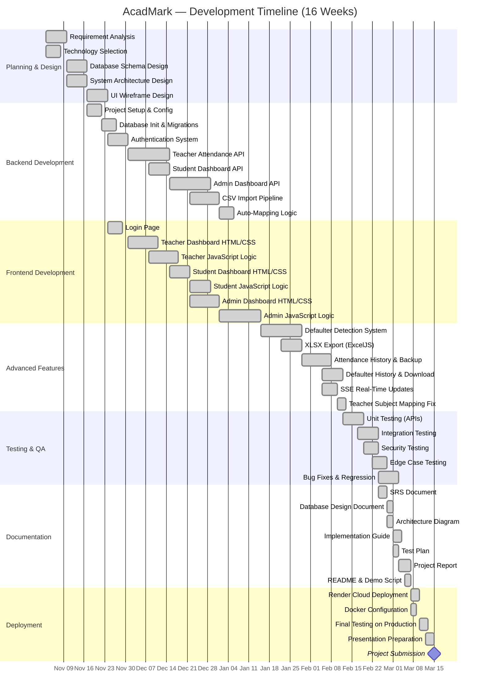
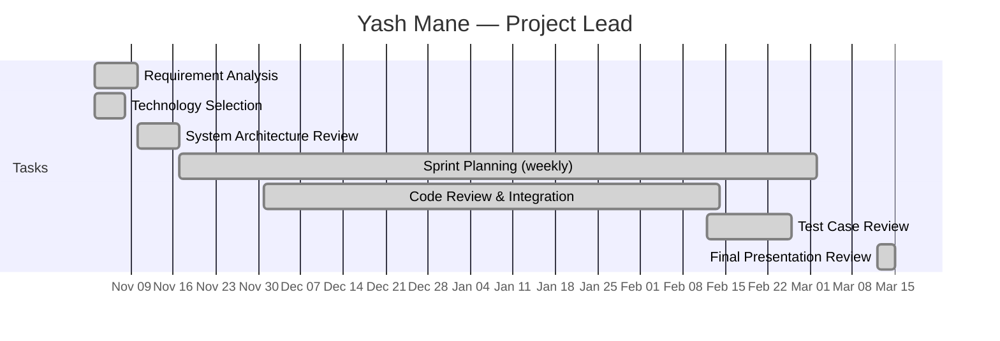
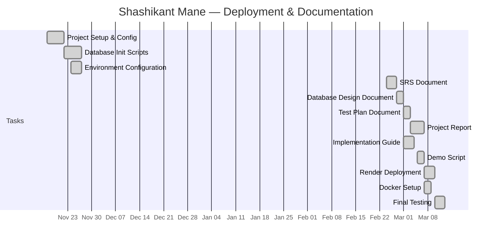
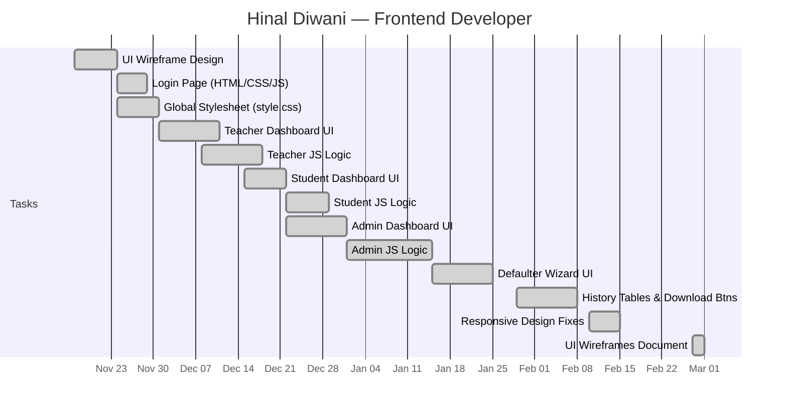
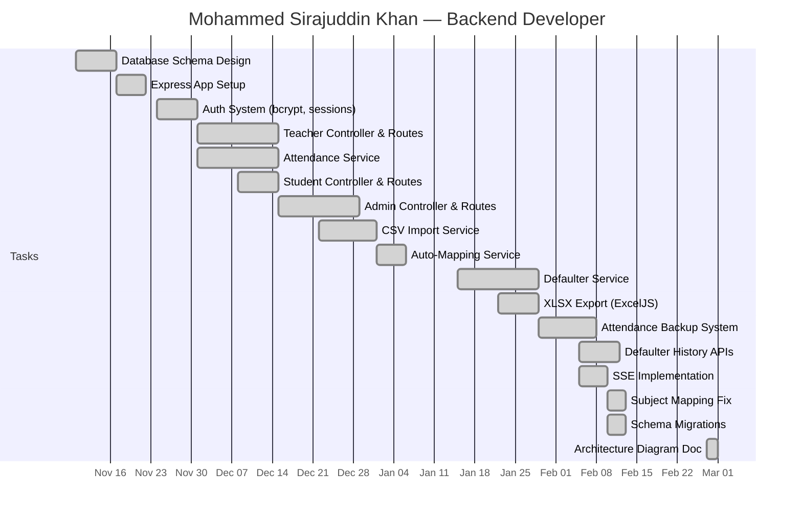

# Gantt Chart — AcadMark Development Timeline

## Student Attendance Management System

| Field         | Detail                                |
| ------------- | ------------------------------------- |
| **Duration**  | 16 Weeks (November 2025 – March 2026) |
| **Team Size** | 4 members                             |

---

## 1. Project Gantt Chart (Mermaid)

---

## 2. Team-Wise Task Assignment

### Yash Mane — Project Lead

### Shashikant Mane — Deployment & Documentation

### Hinal Diwani — Frontend Developer

### Mohammed Sirajuddin Khan — Backend Developer

---

## 3. Phase Summary

| Phase                 | Duration        | Weeks | Primary Owner(s)                       |
| --------------------- | --------------- | ----- | -------------------------------------- |
| **Planning & Design** | Nov 3 – Nov 21  | 1–3   | Yash Mane, Mohammed Sirajuddin Khan    |
| **Backend Core**      | Nov 17 – Jan 5  | 3–9   | Mohammed Sirajuddin Khan               |
| **Frontend Core**     | Nov 24 – Jan 14 | 4–10  | Hinal Diwani                           |
| **Advanced Features** | Jan 15 – Feb 13 | 11–14 | Mohammed Sirajuddin Khan, Hinal Diwani |
| **Testing & QA**      | Feb 12 – Mar 2  | 14–16 | Shashikant Mane, Yash Mane             |
| **Documentation**     | Feb 24 – Mar 7  | 16–17 | Shashikant Mane                        |
| **Deployment**        | Mar 7 – Mar 15  | 17–18 | Shashikant Mane                        |

---

## 4. Milestones

| #   | Milestone                        | Target Date      | Status      |
| --- | -------------------------------- | ---------------- | ----------- |
| M1  | Requirements approved            | Nov 10, 2025     | ✅ Achieved |
| M2  | Database schema finalised        | Nov 17, 2025     | ✅ Achieved |
| M3  | Authentication working           | Dec 1, 2025      | ✅ Achieved |
| M4  | Teacher attendance flow complete | Dec 15, 2025     | ✅ Achieved |
| M5  | All 3 dashboards functional      | Jan 14, 2026     | ✅ Achieved |
| M6  | Defaulter system complete        | Feb 5, 2026      | ✅ Achieved |
| M7  | All features implemented         | Feb 13, 2026     | ✅ Achieved |
| M8  | Testing complete (87/87 pass)    | Mar 2, 2026      | ✅ Achieved |
| M9  | Documentation complete           | Mar 7, 2026      | ✅ Achieved |
| M10 | Cloud deployment live            | Mar 10, 2026     | ✅ Achieved |
| M11 | **Project Submission**           | **Mar 15, 2026** | ✅ Achieved |

---

## 5. Weekly Sprint Log

| Week | Dates        | Sprint Goal            | Deliverables                                   |
| ---- | ------------ | ---------------------- | ---------------------------------------------- |
| 1    | Nov 3–9      | Project kickoff        | Requirements doc, tech stack decision          |
| 2    | Nov 10–16    | Design phase           | DB schema, architecture diagram, UI wireframes |
| 3    | Nov 17–23    | Project setup          | Express app, DB init, config files             |
| 4    | Nov 24–30    | Auth + Login           | Login page, bcrypt auth, session middleware    |
| 5    | Dec 1–7      | Teacher module         | Teacher dashboard API + UI                     |
| 6    | Dec 8–14     | Attendance marking     | Start/end session, student list, P/A marking   |
| 7    | Dec 15–21    | Student + Admin start  | Student dashboard, admin stats                 |
| 8    | Dec 22–28    | Admin module + Import  | Admin UI, CSV import pipeline                  |
| 9    | Dec 29–Jan 4 | Import + Mapping       | Teacher import, auto-mapping                   |
| 10   | Jan 5–14     | Integration            | API integration, cross-module testing          |
| 11   | Jan 15–21    | Defaulter system       | Threshold queries, defaulter wizard            |
| 12   | Jan 22–28    | XLSX export            | ExcelJS integration, download buttons          |
| 13   | Jan 29–Feb 4 | History system         | Attendance backup, defaulter history           |
| 14   | Feb 5–11     | Advanced features      | SSE, subject mapping fix, download history     |
| 15   | Feb 12–28    | Testing                | 87 test cases, bug fixes, security testing     |
| 16   | Mar 1–15     | Documentation + Deploy | All docs, cloud deployment, presentation       |

---

_Gantt chart prepared by **Yash Mane** (Project Lead) and **Shashikant Mane** (Deployment & Documentation)._
