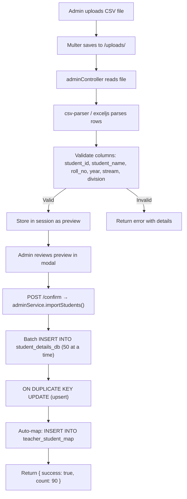

# Implementation Guide — AcadMark

## Student Attendance Management System

---

## Table of Contents

1. [Prerequisites](#1-prerequisites)
2. [Project Setup](#2-project-setup)
3. [Database Configuration](#3-database-configuration)
4. [Folder Structure Deep Dive](#4-folder-structure-deep-dive)
5. [Express Application Setup](#5-express-application-setup)
6. [Routing System](#6-routing-system)
7. [Controller Implementation Patterns](#7-controller-implementation-patterns)
8. [Service Layer](#8-service-layer)
9. [Authentication & Middleware](#9-authentication--middleware)
10. [Frontend Implementation](#10-frontend-implementation)
11. [API Reference with Examples](#11-api-reference-with-examples)
12. [Data Import Pipeline](#12-data-import-pipeline)
13. [XLSX Export Pipeline](#13-xlsx-export-pipeline)
14. [Server-Sent Events (SSE)](#14-server-sent-events-sse)
15. [Deployment Steps](#15-deployment-steps)

---

## 1. Prerequisites

| Software | Version    | Install Command                        |
| -------- | ---------- | -------------------------------------- |
| Node.js  | ≥ 18.0 LTS | [nodejs.org](https://nodejs.org)       |
| MySQL    | ≥ 8.0      | [dev.mysql.com](https://dev.mysql.com) |
| npm      | ≥ 9.0      | Bundled with Node.js                   |
| Git      | Latest     | [git-scm.com](https://git-scm.com)     |

### Verify Installation

```powershell
node --version       # v18.x.x or higher
npm --version        # 9.x.x or higher
mysql --version      # Ver 8.0.x
git --version        # git version 2.x.x
```

---

## 2. Project Setup

### 2.1 Clone the Repository

```bash
git clone https://github.com/MohammedSirajuddinKhan/Acadmark.git
cd Acadmark
```

### 2.2 Install Dependencies

```bash
npm install
```

### 2.3 Environment Configuration

Create a `.env` file in the project root:

```env
# Server
PORT=3000
NODE_ENV=development

# MySQL Database
DB_HOST=localhost
DB_USER=root
DB_PASSWORD=your_mysql_password
DB_NAME=acadmark_db

# Session
SESSION_SECRET=your-random-secret-key-here
```

### 2.4 Create the Database

```sql
CREATE DATABASE IF NOT EXISTS acadmark_db
  CHARACTER SET utf8mb4
  COLLATE utf8mb4_0900_ai_ci;
```

### 2.5 Start the Server

```bash
# Development (with auto-reload)
npm run dev

# Production
npm start
```

The server will:

1. Connect to MySQL
2. Auto-create all tables if they don't exist (`init-db.js`)
3. Run schema migrations (composite key for teacher assignments)
4. Create the `Defaulter_History_Lists` table
5. Start listening on the configured port

### 2.6 `package.json` Scripts

```json
{
  "type": "module",
  "scripts": {
    "start": "node server.js",
    "dev": "nodemon server.js"
  }
}
```

> **Note**: The project uses **ES Modules** (`"type": "module"`) — all imports use `import/export` syntax, not `require()`.

---

## 3. Database Configuration

### 3.1 Connection Pool (`config/db.js`)

```javascript
import mysql from "mysql2/promise";
import dotenv from "dotenv";

dotenv.config();

const pool = mysql.createPool({
  host: process.env.DB_HOST || "localhost",
  user: process.env.DB_USER || "root",
  password: process.env.DB_PASSWORD || "",
  database: process.env.DB_NAME || "acadmark_db",
  waitForConnections: true,
  connectionLimit: 10,
  queueLimit: 0,
});

export default pool;
```

### 3.2 Initialisation (`init-db.js`)

The initialisation script runs automatically on server start:

1. **Check tables** — `SHOW TABLES` to detect if the database is empty.
2. **Create tables** — Execute `database_setup.sql` if needed.
3. **Fix missing tables** — Run `fix_missing_tables.sql` as a safety net.
4. **Schema migrations** — Migrate `teacher_details_db` from single-column unique key to composite key.
5. **Create Defaulter table** — Ensure `Defaulter_History_Lists` exists.

---

## 4. Folder Structure Deep Dive

```
acadmark/
│
├── server.js                 # HTTP server entry point
│   └── Imports src/app.js, calls app.listen()
│
├── init-db.js                # Database bootstrap + migrations
│   └── Called from server.js before listen()
│
├── config/
│   └── db.js                 # MySQL connection pool (singleton)
│
├── src/
│   ├── app.js                # Express app configuration
│   │   ├── Middleware setup (cors, body-parser, session, static files)
│   │   ├── Route mounting (/api/auth, /api/admin, /api/teacher, /api/student)
│   │   └── HTML page routes (/, /admin, /teacher, /student)
│   │
│   ├── controllers/          # Request handlers (business logic)
│   │   ├── authController.js       # login(), logout()
│   │   ├── adminController.js      # 25+ exported functions
│   │   ├── teacherController.js    # 20+ exported functions
│   │   ├── studentController.js    # 7 exported functions
│   │   └── deleteController.js     # Cascade delete utilities
│   │
│   ├── middlewares/
│   │   └── authMiddleware.js       # requireAuth(), requireRole()
│   │
│   ├── routes/               # Express Router definitions
│   │   ├── authRoutes.js           # /api/auth/*
│   │   ├── adminRoutes.js          # /api/admin/*
│   │   ├── teacherRoutes.js        # /api/teacher/*
│   │   └── studentRoutes.js        # /api/student/*
│   │
│   ├── services/             # Reusable business logic
│   │   ├── adminService.js         # CSV parsing, bulk insert, auto-mapping
│   │   ├── attendanceService.js    # Session lifecycle, record management
│   │   ├── defaulterService.js     # Threshold calculation, XLSX generation
│   │   └── notificationService.js  # SSE client management
│   │
│   └── utils/                # Shared utilities
│
├── public/                   # Static assets (served by Express)
│   ├── css/style.css
│   ├── js/ (login.js, admin.js, teacher.js, student.js, main.js)
│   └── templates/ (CSV templates)
│
├── views/                    # HTML pages (served by Express)
│   ├── login.html
│   ├── admin.html
│   ├── teacher.html
│   └── student.html
│
└── uploads/                  # Temporary file store (multer)
```

---

## 5. Express Application Setup

### `src/app.js` — Core Configuration

```javascript
import express from "express";
import session from "express-session";
import MySQLStore from "express-mysql-session";
import path from "path";
import { fileURLToPath } from "url";

import authRoutes from "./routes/authRoutes.js";
import adminRoutes from "./routes/adminRoutes.js";
import teacherRoutes from "./routes/teacherRoutes.js";
import studentRoutes from "./routes/studentRoutes.js";
import { requireAuth, requireRole } from "./middlewares/authMiddleware.js";

const app = express();

// Middleware stack
app.use(express.json());
app.use(express.urlencoded({ extended: true }));
app.use(express.static(path.join(__dirname, "../public")));

// Session configuration
const MySQLStoreSession = MySQLStore(session);
app.use(
  session({
    key: "acadmark_session",
    secret: process.env.SESSION_SECRET || "fallback-secret",
    store: new MySQLStoreSession({
      /* pool options */
    }),
    resave: false,
    saveUninitialized: false,
    cookie: { maxAge: 86400000 }, // 24 hours
  }),
);

// Route mounting
app.use("/api/auth", authRoutes);
app.use("/api/admin", requireAuth, requireRole("admin"), adminRoutes);
app.use("/api/teacher", requireAuth, requireRole("teacher"), teacherRoutes);
app.use("/api/student", requireAuth, requireRole("student"), studentRoutes);

// HTML page routes
app.get("/", (req, res) => res.sendFile("login.html", { root: "views" }));
app.get("/admin", requireAuth, requireRole("admin"), (req, res) =>
  res.sendFile("admin.html", { root: "views" }),
);
app.get("/teacher", requireAuth, requireRole("teacher"), (req, res) =>
  res.sendFile("teacher.html", { root: "views" }),
);
app.get("/student", requireAuth, requireRole("student"), (req, res) =>
  res.sendFile("student.html", { root: "views" }),
);

export default app;
```

---

## 6. Routing System

### Pattern: Router → Middleware → Controller

```javascript
// src/routes/teacherRoutes.js
import { Router } from "express";
import {
  teacherDashboard,
  startAttendance,
  endAttendance,
} from "../controllers/teacherController.js";

const router = Router();

router.get("/dashboard", teacherDashboard);
router.post("/attendance/start", startAttendance);
router.post("/attendance/end", endAttendance);
// ... more routes

export default router;
```

### Route Prefix Mapping

| Mount Path     | File               | Middleware                               |
| -------------- | ------------------ | ---------------------------------------- |
| `/api/auth`    | `authRoutes.js`    | None (public)                            |
| `/api/admin`   | `adminRoutes.js`   | `requireAuth` + `requireRole('admin')`   |
| `/api/teacher` | `teacherRoutes.js` | `requireAuth` + `requireRole('teacher')` |
| `/api/student` | `studentRoutes.js` | `requireAuth` + `requireRole('student')` |

---

## 7. Controller Implementation Patterns

### Standard Controller Function Pattern

```javascript
// src/controllers/teacherController.js
export async function teacherDashboard(req, res) {
  try {
    const teacherId = req.session.userId;

    // 1. Query database
    const [teacherRows] = await pool.query(
      `SELECT DISTINCT teacher_id, name, subject, year, stream, semester, division
             FROM teacher_details_db WHERE teacher_id = ?`,
      [teacherId],
    );

    // 2. Process data
    const teacherInfo = teacherRows[0];
    const uniqueSubjects = [
      ...new Set(teacherRows.map((r) => r.subject).filter(Boolean)),
    ];

    // 3. Return JSON response
    res.json({
      success: true,
      teacherInfo,
      subjects: uniqueSubjects,
      assignmentCount: teacherRows.length,
      studentCount: mappedCount,
    });
  } catch (error) {
    console.error("Dashboard error:", error);
    res.status(500).json({ success: false, error: "Failed to load dashboard" });
  }
}
```

### Error Handling Pattern

Every controller function follows the same try-catch structure:

```javascript
export async function someFunction(req, res) {
  try {
    // Business logic...
    res.json({ success: true, data: result });
  } catch (error) {
    console.error("Error in someFunction:", error);
    res.status(500).json({ success: false, error: error.message });
  }
}
```

---

## 8. Service Layer

### 8.1 `adminService.js` — Data Import

```javascript
export async function importStudents(students) {
  const BATCH_SIZE = 50;
  const connection = await pool.getConnection();

  try {
    await connection.beginTransaction();

    for (let i = 0; i < students.length; i += BATCH_SIZE) {
      const batch = students.slice(i, i + BATCH_SIZE);
      // Batch INSERT ... ON DUPLICATE KEY UPDATE
    }

    await connection.commit();
  } catch (error) {
    await connection.rollback();
    throw error;
  } finally {
    connection.release();
  }
}
```

### 8.2 `attendanceService.js` — Session Lifecycle

```javascript
// Start a new session → returns session_id
export async function startAttendanceSession({ teacherId, subject, year, ... }) { }

// Finalize: save P/A records, update session stats
export async function finalizeAttendanceSession(sessionId, teacherId, records) { }

// Query stats for teacher
export async function getTeacherStats(teacherId) { }
```

### 8.3 `defaulterService.js` — Threshold & Export

```javascript
// Calculate defaulters below threshold
export async function getDefaulters({
  year,
  stream,
  division,
  month,
  threshold,
}) {}

// Generate XLSX file buffer
export async function generateDefaulterExcel(defaulters, filters) {}
```

### 8.4 `notificationService.js` — SSE Management

```javascript
const clients = new Map();

export function addClient(id, res) {
  clients.set(id, res);
}
export function removeClient(id) {
  clients.delete(id);
}
export function broadcast(event) {
  clients.forEach((res) => {
    res.write(`data: ${JSON.stringify(event)}\n\n`);
  });
}
```

---

## 9. Authentication & Middleware

### 9.1 Login Flow

```javascript
// src/controllers/authController.js
export async function login(req, res) {
  const { userId, password } = req.body;

  // Check admin, teacher, or student tables
  // Compare bcrypt hash
  // Set session: req.session.userId, req.session.role
  // Return { role, redirect }
}
```

### 9.2 Auth Middleware

```javascript
// src/middlewares/authMiddleware.js
export function requireAuth(req, res, next) {
  if (!req.session || !req.session.userId) {
    return res.status(401).json({ error: "Not authenticated" });
  }
  next();
}

export function requireRole(...roles) {
  return (req, res, next) => {
    if (!roles.includes(req.session.role)) {
      return res.status(403).json({ error: "Forbidden" });
    }
    next();
  };
}
```

---

## 10. Frontend Implementation

### 10.1 Architecture

Each HTML page has a corresponding JS file that:

1. Runs on `DOMContentLoaded`
2. Calls the dashboard API via `fetch()`
3. Populates the UI with response data
4. Sets up event listeners for user interaction

### 10.2 Common Fetch Pattern

```javascript
// public/js/teacher.js
async function loadDashboard() {
  try {
    const response = await fetch("/api/teacher/dashboard");
    if (!response.ok) throw new Error("Failed to load");

    const data = await response.json();

    // Populate UI
    document.getElementById("teacher-name").textContent = data.teacherInfo.name;
    document.getElementById("subject-count").textContent = data.subjects.length;
  } catch (error) {
    showToast("Error loading dashboard", "error");
  }
}

document.addEventListener("DOMContentLoaded", loadDashboard);
```

### 10.3 Modal Pattern

```javascript
function openModal(modalId) {
  document.getElementById(modalId).style.display = "flex";
}

function closeModal(modalId) {
  document.getElementById(modalId).style.display = "none";
}
```

### 10.4 Toast Notification

```javascript
function showToast(message, type = "info") {
  const toast = document.createElement("div");
  toast.className = `toast toast-${type}`;
  toast.textContent = message;
  document.body.appendChild(toast);
  setTimeout(() => toast.remove(), 3000);
}
```

---

## 11. API Reference with Examples

### 11.1 Login

```http
POST /api/auth/login
Content-Type: application/json

{
    "userId": "T001",
    "password": "password123"
}
```

**Response:**

```json
{
  "success": true,
  "role": "teacher",
  "redirect": "/teacher"
}
```

### 11.2 Teacher Dashboard

```http
GET /api/teacher/dashboard
Cookie: acadmark_session=abc123
```

**Response:**

```json
{
  "success": true,
  "teacherInfo": {
    "teacher_id": "T001",
    "name": "Prof. John Doe",
    "subject": "DBMS",
    "year": "TY",
    "stream": "BSCIT",
    "division": "A"
  },
  "subjects": ["DBMS", "Software Engineering"],
  "assignmentCount": 2,
  "studentCount": 60
}
```

### 11.3 Get Defaulters

```http
GET /api/teacher/defaulters?year=TY&stream=BSCIT&division=A&month=3&threshold=75
Cookie: acadmark_session=abc123
```

**Response:**

```json
{
  "success": true,
  "defaulters": [
    {
      "student_id": "TY-BSCIT-A-05",
      "student_name": "Student 5",
      "roll_no": 5,
      "attendance_percentage": 45.0,
      "present_count": 9,
      "total_sessions": 20
    }
  ],
  "count": 8,
  "threshold": 75,
  "filters": { "year": "TY", "stream": "BSCIT", "division": "A", "month": 3 }
}
```

### 11.4 Download Defaulter XLSX

```http
GET /api/teacher/defaulters/download?year=TY&stream=BSCIT&division=A&threshold=75
Cookie: acadmark_session=abc123
```

**Response:** Binary XLSX file stream with `Content-Disposition: attachment; filename="defaulters_*.xlsx"`

---

## 12. Data Import Pipeline



### CSV Template (students)

```csv
student_id,student_name,roll_no,year,stream,division
TY-BSCIT-A-01,Student Name,1,TY,BSCIT,A
TY-BSCIT-A-02,Another Student,2,TY,BSCIT,A
```

### CSV Template (teachers)

```csv
teacher_id,name,subject,year,stream,semester,division
T001,Prof. Doe,DBMS,TY,BSCIT,5,A
T001,Prof. Doe,Software Engineering,TY,BSCIT,5,B
```

---

## 13. XLSX Export Pipeline

```javascript
// src/services/defaulterService.js
import ExcelJS from "exceljs";

export async function generateDefaulterExcel(defaulters, filters) {
  const workbook = new ExcelJS.Workbook();
  const sheet = workbook.addWorksheet("Defaulters");

  // Header row
  sheet.columns = [
    { header: "Sr.No", key: "srno", width: 8 },
    { header: "Student ID", key: "id", width: 20 },
    { header: "Name", key: "name", width: 30 },
    { header: "Roll No", key: "roll", width: 10 },
    { header: "Attendance%", key: "pct", width: 15 },
    { header: "Present", key: "present", width: 10 },
    { header: "Total", key: "total", width: 10 },
  ];

  // Style header
  sheet.getRow(1).font = { bold: true };
  sheet.getRow(1).fill = {
    type: "pattern",
    pattern: "solid",
    fgColor: { argb: "FF4A90D9" },
  };

  // Data rows
  defaulters.forEach((d, i) => {
    sheet.addRow({
      srno: i + 1,
      id: d.student_id,
      name: d.student_name,
      roll: d.roll_no,
      pct: d.attendance_percentage,
      present: d.present_count,
      total: d.total_sessions,
    });
  });

  // Return buffer
  return await workbook.xlsx.writeBuffer();
}
```

---

## 14. Server-Sent Events (SSE)

### Server-side (Express Route)

```javascript
router.get("/live-updates", (req, res) => {
  res.writeHead(200, {
    "Content-Type": "text/event-stream",
    "Cache-Control": "no-cache",
    Connection: "keep-alive",
  });

  const clientId = Date.now();
  notificationService.addClient(clientId, res);

  req.on("close", () => {
    notificationService.removeClient(clientId);
  });
});
```

### Client-side (JavaScript)

```javascript
const eventSource = new EventSource("/api/teacher/live-updates");

eventSource.onmessage = (event) => {
  const data = JSON.parse(event.data);
  if (data.type === "attendance_saved") {
    showToast("Attendance session saved!", "success");
    refreshDashboard();
  }
};

eventSource.onerror = () => {
  console.log("SSE connection lost, reconnecting...");
};
```

---

## 15. Deployment Steps

### 15.1 Local Development

```bash
npm install
cp .env.example .env          # Edit with your MySQL credentials
npm run dev                    # Starts with nodemon
```

### 15.2 Production (Render)

1. Push to GitHub
2. Create a new **Web Service** on Render
3. Set **Build Command**: `npm install`
4. Set **Start Command**: `node server.js`
5. Add environment variables (DB_HOST, DB_USER, DB_PASSWORD, DB_NAME, SESSION_SECRET)
6. Deploy

### 15.3 Docker

```bash
docker build -t acadmark .
docker run -p 3000:3000 \
    -e DB_HOST=host.docker.internal \
    -e DB_USER=root \
    -e DB_PASSWORD=secret \
    -e DB_NAME=acadmark_db \
    -e SESSION_SECRET=my-secret \
    acadmark
```

### 15.4 Heroku

```bash
heroku create acadmark-app
heroku addons:create jawsdb:kitefin    # MySQL add-on
git push heroku main
```

---

_Document prepared by **Mohammed Sirajuddin Khan** (Backend Developer) and **Shashikant Mane** (Deployment & Documentation)._
