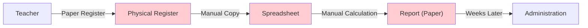
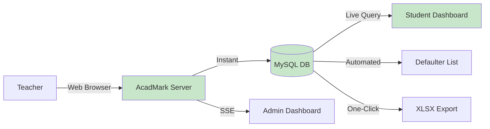
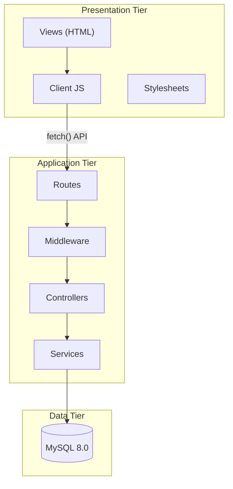
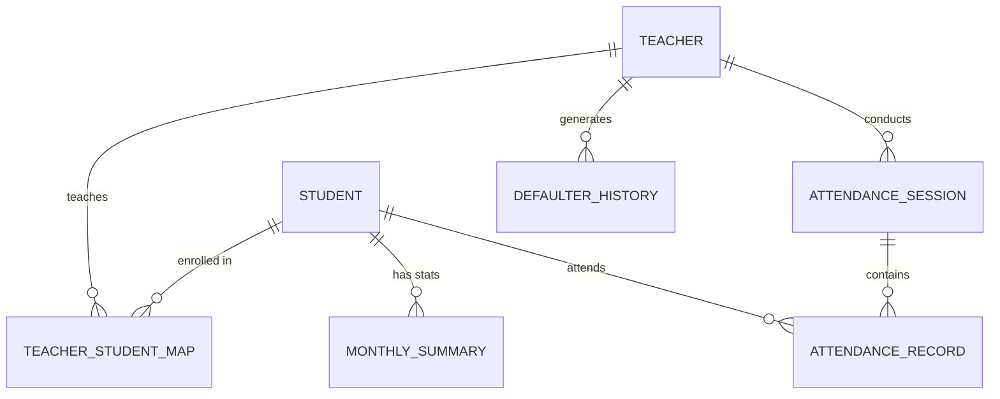
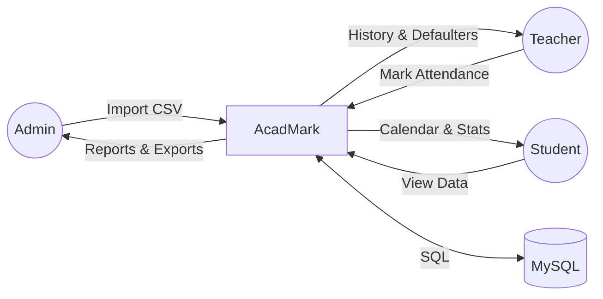
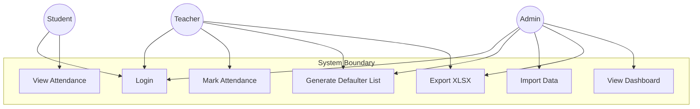

# Project Report — AcadMark

## Student Attendance Management Web Application

| Field             | Detail                                                                                |
| ----------------- | ------------------------------------------------------------------------------------- |
| **Institution**   | Sheth N.K.T.T. College of Commerce & Sheth J.T.T. College of Arts (Autonomous), Thane |
| **Department**    | Bachelor of Science in Information Technology (B.Sc. IT)                              |
| **Academic Year** | 2025–2026                                                                             |
| **Semester**      | VI                                                                                    |
| **Subject**       | Project                                                                               |
| **Submitted By**  | Yash Mane, Shashikant Mane, Hinal Diwani, Mohammed Sirajuddin Khan                    |

---

## Table of Contents

1. [Abstract](#1-abstract)
2. [Introduction](#2-introduction)
3. [Literature Review](#3-literature-review)
4. [Problem Statement](#4-problem-statement)
5. [Objectives](#5-objectives)
6. [System Analysis](#6-system-analysis)
7. [System Design](#7-system-design)
8. [Implementation](#8-implementation)
9. [Testing](#9-testing)
10. [Results & Screenshots](#10-results--screenshots)
11. [Advantages & Limitations](#11-advantages--limitations)
12. [Future Scope](#12-future-scope)
13. [Conclusion](#13-conclusion)
14. [References](#14-references)
15. [Appendix — Team Contribution](#15-appendix--team-contribution)

---

## 1. Abstract

**AcadMark** is a web-based Student Attendance Management System developed to automate the traditionally manual process of recording, tracking, and reporting student attendance in educational institutions. Built using **Node.js**, **Express.js**, and **MySQL**, the system provides role-based dashboards for administrators, teachers, and students. Key features include real-time attendance marking, automated defaulter list generation with configurable thresholds, CSV/XLSX import and export, attendance backup and history, and monthly calendar views for students. The system eliminates paper-based attendance registers, reduces human error, and enables instant reporting — thereby improving institutional efficiency and transparency.

**Keywords**: Attendance Management, Web Application, Node.js, Express.js, MySQL, Defaulter Detection, XLSX Export, Role-Based Access Control

---

## 2. Introduction

### 2.1 Background

Attendance tracking is a fundamental administrative function in educational institutions. Traditional paper-based attendance registers suffer from several drawbacks: they are time-consuming to maintain, prone to transcription errors, difficult to aggregate for reporting, and offer no self-service capability for students.

The National Assessment and Accreditation Council (NAAC) in India requires institutions to maintain systematic attendance records and enforce minimum attendance thresholds (typically 75%). This regulatory requirement creates a need for efficient, digital attendance systems.

### 2.2 Motivation

Our college currently uses a combination of physical registers and spreadsheets to manage attendance. This leads to:

- **Delayed reporting** — Monthly attendance percentages are calculated manually, often weeks after the fact.
- **No student visibility** — Students cannot check their own attendance status until reports are published.
- **Error-prone defaulter identification** — Manually identifying students below the 75% threshold is tedious and error-prone.
- **No centralised backup** — Attendance data exists in individual teacher files without institutional backup.

AcadMark addresses all of these challenges through a centralised, role-based web application.

### 2.3 Scope

The system is designed for a single institution with the following scope:

- Support for multiple academic years (FY, SY, TY), streams (BSCIT), and divisions (A, B, C).
- Up to 50 teachers and 5,000 students.
- Subject-wise attendance tracking.
- Defaulter detection with configurable thresholds.
- Data import/export via CSV and XLSX files.

---

## 3. Literature Review

| #   | Reference                                                                                                              | Key Contribution                         | Relevance to AcadMark                                                                  |
| --- | ---------------------------------------------------------------------------------------------------------------------- | ---------------------------------------- | -------------------------------------------------------------------------------------- |
| 1   | S. Kadry & K. Smaili (2007), "A Design and Implementation of a Wireless Iris Recognition Attendance Management System" | Biometric attendance using iris scanning | Our system uses ID-based authentication; biometric integration is future scope         |
| 2   | M. Dey et al. (2020), "Attendance Management System Using Face Recognition"                                            | Computer vision for automated attendance | We use manual marking but with digital efficiency; face recognition is future scope    |
| 3   | A. Shehu & I. Dika (2010), "Using Real Time Computer Vision Algorithms in Automatic Attendance Management Systems"     | Real-time image processing               | Our SSE-based real-time updates serve a similar "live status" purpose without hardware |
| 4   | Node.js Foundation (2023), "Express.js Documentation"                                                                  | REST API framework best practices        | Directly used: Express routing, middleware, session management                         |
| 5   | Oracle (2023), "MySQL 8.0 Reference Manual"                                                                            | Relational database design patterns      | Directly used: InnoDB, foreign keys, transactions, parameterized queries               |
| 6   | ExcelJS Documentation (2023)                                                                                           | Programmatic spreadsheet generation      | Directly used: XLSX export for attendance and defaulter reports                        |

### Key Insights from Literature

- Automated attendance systems significantly reduce administrative overhead (60–80% time saving).
- Role-based access control is essential for multi-stakeholder systems.
- Most existing systems are desktop-based or require proprietary hardware; web-based solutions are more accessible.
- Threshold-based defaulter detection is a common requirement across Indian colleges.

---

## 4. Problem Statement

**To design and develop a web-based student attendance management system that enables teachers to mark attendance digitally, allows students to view their attendance records in real time, and empowers administrators to generate defaulter lists, import/export data, and manage the institution's attendance records — replacing the existing manual, paper-based system with a centralised, efficient, and transparent digital solution.**

---

## 5. Objectives

1. **Digitise attendance recording** — Replace paper registers with a web-based attendance marking interface.
2. **Enable student self-service** — Allow students to view their attendance percentage, calendar, and session history.
3. **Automate defaulter detection** — Generate defaulter lists based on configurable attendance thresholds.
4. **Provide data import/export** — Enable bulk import of students and teachers via CSV/XLSX and export of reports.
5. **Ensure data security** — Implement role-based access control, password hashing, and session management.
6. **Create institutional backup** — Automatically save attendance session snapshots for audit and recovery.
7. **Support real-time updates** — Push live notifications when attendance is marked or reports are generated.

---

## 6. System Analysis

### 6.1 Existing System



**Drawbacks:**

- Time-consuming manual data entry
- Prone to human error
- No real-time student access
- No automated defaulter detection
- No centralised backup

### 6.2 Proposed System



**Advantages:**

- Instant digital recording
- Real-time student visibility
- Automated threshold-based defaulter detection
- One-click XLSX export
- Centralised backup with JSON snapshots

### 6.3 Feasibility Study

| Feasibility     | Assessment                                                                              |
| --------------- | --------------------------------------------------------------------------------------- |
| **Technical**   | ✅ All technologies (Node.js, MySQL, HTML/CSS/JS) are mature, well-documented, and free |
| **Economic**    | ✅ Zero licensing cost (open-source stack), minimal server requirements                 |
| **Operational** | ✅ Teachers need minimal training (web browser interface), IT support for initial setup |
| **Schedule**    | ✅ 16-week development timeline is achievable for the defined scope                     |

---

## 7. System Design

### 7.1 Architecture

AcadMark follows a three-tier **MVC-inspired** architecture:



### 7.2 Entity-Relationship Diagram



### 7.3 Data Flow Diagram (Level 0)



### 7.4 Use Case Diagram



---

## 8. Implementation

### 8.1 Technology Stack

| Component       | Technology               | Justification                                                   |
| --------------- | ------------------------ | --------------------------------------------------------------- |
| Server Runtime  | Node.js 18               | Non-blocking I/O, npm ecosystem, JavaScript full-stack          |
| Web Framework   | Express.js 4             | Most popular Node.js framework, robust middleware system        |
| Database        | MySQL 8.0                | Reliable RDBMS, strong ACID compliance, widely supported        |
| DB Driver       | mysql2/promise           | Async/await support, prepared statements                        |
| Template        | Static HTML              | Simple, no server-side rendering overhead                       |
| Frontend        | Vanilla JavaScript       | No framework dependency, smaller bundle size                    |
| Auth            | bcrypt + express-session | Industry-standard password hashing, server-side sessions        |
| File Upload     | multer                   | Battle-tested middleware for multipart file handling            |
| XLSX Generation | ExcelJS                  | Feature-rich Excel file creation with styling support           |
| CSV Parsing     | csv-parser               | Streaming CSV parser for large files                            |
| Real-time       | Server-Sent Events       | Native browser support, simpler than WebSocket for one-way push |

### 8.2 Module Implementation Summary

#### 8.2.1 Authentication Module

```javascript
// Password hashing (during import)
const hashedPassword = await bcrypt.hash(rawPassword, 10);

// Password verification (during login)
const isValid = await bcrypt.compare(inputPassword, storedHash);

// Session creation
req.session.userId = user.teacher_id;
req.session.role = "teacher";
req.session.name = user.name;
```

#### 8.2.2 Attendance Marking Module

The attendance marking flow consists of three stages:

1. **Class Selection** — Teacher selects Year, Stream, Division, Subject, Semester via dropdowns (restricted to their assignments).
2. **Student Loading** — System fetches mapped students via `teacher_student_map` JOIN `student_details_db`.
3. **Marking & Saving** — Teacher marks P/A per student, clicks "End Session" → batch INSERT with deduplication.

```javascript
// Deduplication: keep last occurrence per student
const uniqueRecords = [];
const seenStudents = new Set();
for (let i = records.length - 1; i >= 0; i--) {
  if (!seenStudents.has(records[i].studentId)) {
    seenStudents.add(records[i].studentId);
    uniqueRecords.unshift(records[i]);
  }
}
```

#### 8.2.3 Defaulter Detection Module

The defaulter detection algorithm:

1. **Input**: Year, Stream, Division, Month (optional), Threshold percentage.
2. **Query**: Aggregate `attendance_records` by student, calculate `(present_count / total_sessions) × 100`.
3. **Filter**: Return students where `attendance_percentage < threshold`.
4. **Auto-Save**: INSERT snapshot into `Defaulter_History_Lists` as JSON.
5. **Export**: Generate XLSX using ExcelJS with formatted headers and data rows.

#### 8.2.4 Data Import Module

```
CSV Upload → Multer → Parse → Validate → Preview → Confirm → Batch INSERT
```

- Batch size: 50 rows per INSERT statement
- Upsert: `INSERT ... ON DUPLICATE KEY UPDATE`
- Auto-mapping: After import, students are automatically mapped to teachers based on Year/Stream/Division match.

### 8.3 Database Tables

The system uses **11 tables**:

| #   | Table                        | Purpose                                         |
| --- | ---------------------------- | ----------------------------------------------- |
| 1   | `student_details_db`         | Student master records                          |
| 2   | `teacher_details_db`         | Teacher assignment records                      |
| 3   | `teacher_student_map`        | M:N mapping of teachers to students             |
| 4   | `attendance_sessions`        | Session metadata (start/end time, counts)       |
| 5   | `attendance_records`         | Individual attendance marks (session × student) |
| 6   | `attendance_backup`          | Full session snapshots (JSON + base64 CSV)      |
| 7   | `Defaulter_History_Lists`    | Saved defaulter list snapshots                  |
| 8   | `monthly_attendance_summary` | Pre-aggregated monthly stats                    |
| 9   | `student_attendance_stats`   | Running overall stats per student               |
| 10  | `activity_logs`              | Audit trail                                     |
| 11  | `sessions`                   | express-session store                           |

### 8.4 API Endpoints Summary

| Module    | GET    | POST   | DELETE | Total  |
| --------- | ------ | ------ | ------ | ------ |
| Auth      | 0      | 2      | 0      | 2      |
| Admin     | 19     | 5      | 2      | 26     |
| Teacher   | 14     | 7      | 1      | 22     |
| Student   | 6      | 1      | 0      | 7      |
| **Total** | **39** | **15** | **3**  | **57** |

---

## 9. Testing

### 9.1 Testing Strategy

| Level       | Method                     | Tools                     |
| ----------- | -------------------------- | ------------------------- |
| Unit        | Manual function testing    | Node.js test scripts      |
| Integration | API endpoint testing       | Postman, curl             |
| System      | End-to-end user flows      | Browser (Chrome DevTools) |
| Security    | Injection & access testing | Manual + Postman          |

### 9.2 Test Summary

| Module            | Test Cases | Passed | Pass Rate |
| ----------------- | ---------- | ------ | --------- |
| Authentication    | 10         | 10     | 100%      |
| Admin Module      | 10         | 10     | 100%      |
| Teacher Module    | 13         | 13     | 100%      |
| Student Module    | 7          | 7      | 100%      |
| Data Import       | 9          | 9      | 100%      |
| Defaulter System  | 12         | 12     | 100%      |
| Export / Download | 7          | 7      | 100%      |
| Edge Cases        | 12         | 12     | 100%      |
| Security          | 7          | 7      | 100%      |
| **Total**         | **87**     | **87** | **100%**  |

_Refer to [Test_Plan.md](./Test_Plan.md) for the complete test case matrix._

---

## 10. Results & Screenshots

### 10.1 Login Page

> **📸 Screenshot**: `screenshots/login.png`
>
> The login page displays the AcadMark branding with User ID and Password fields. Role-based authentication routes users to their respective dashboards.

### 10.2 Admin Dashboard

> **📸 Screenshot**: `screenshots/admin_dashboard.png`
>
> The admin dashboard shows aggregate statistics (90 students, 5 teachers, 1 stream, 6 subjects) with import, history, and defaulter management tabs.

### 10.3 Teacher Attendance Marking

> **📸 Screenshot**: `screenshots/teacher_attendance.png`
>
> The teacher selects class configuration from dropdowns, views the student list, marks Present/Absent, and ends the session. Present/Absent counts update in real time.

### 10.4 Defaulter List Generation

> **📸 Screenshot**: `screenshots/defaulter_list.png`
>
> The defaulter wizard with threshold slider shows students below the selected percentage. Results can be viewed in a table or downloaded as XLSX.

### 10.5 Student Calendar View

> **📸 Screenshot**: `screenshots/student_calendar.png`
>
> The student dashboard displays a monthly attendance calendar with green (Present) and red (Absent) date markers, along with an overall attendance percentage.

### 10.6 XLSX Export Sample

> **📸 Screenshot**: `screenshots/xlsx_export.png`
>
> An exported XLSX file showing formatted headers (blue background, white text) with student attendance data.

---

## 11. Advantages & Limitations

### 11.1 Advantages

1. **Time Efficiency** — Attendance marking reduced from 5–10 minutes (paper) to under 2 minutes (digital).
2. **Accuracy** — Eliminates transcription errors inherent in manual copy processes.
3. **Instant Reporting** — Defaulter lists generated in seconds, not hours.
4. **Student Empowerment** — Students can check their own attendance 24/7 without approaching faculty.
5. **Data Backup** — Every session is automatically backed up with JSON snapshots.
6. **Export Flexibility** — One-click XLSX export for compliance reporting and physical archival.
7. **Zero Cost** — Entire stack is open-source (Node.js, Express, MySQL, ExcelJS).
8. **Cross-Platform** — Web-based, accessible from any device with a browser.
9. **Real-Time Updates** — SSE pushes live notifications to connected dashboards.

### 11.2 Limitations

1. **No Biometric Integration** — Attendance requires manual marking by teachers; no fingerprint or face recognition.
2. **Single Institution** — Not designed for multi-tenant (multiple college) deployment.
3. **No Mobile App** — Responsive web interface but no native Android/iOS application.
4. **No Offline Mode** — Requires active internet/LAN connection.
5. **Basic Reporting** — No advanced analytics, charts, or predictive modelling.
6. **No Email Notifications** — No email alerts to parents or students for low attendance.

---

## 12. Future Scope

1. **Biometric / Face Recognition** — Integrate with webcam or fingerprint scanner for automated attendance.
2. **Mobile Application** — Develop React Native or Flutter apps for teachers and students.
3. **Email / SMS Alerts** — Notify parents and students when attendance drops below threshold.
4. **Analytics Dashboard** — Add charts (attendance trends, subject-wise comparison) using Chart.js.
5. **Multi-Institution Support** — Add tenant isolation for deployment across multiple colleges.
6. **Timetable Integration** — Auto-determine the subject and class based on the current timetable slot.
7. **PWA Support** — Convert to a Progressive Web App for offline capability.
8. **API Documentation** — Add Swagger/OpenAPI for third-party integration.
9. **Audit Logging** — Enhanced audit trails with IP addresses and device fingerprints.
10. **Cloud Deployment** — One-click deployment templates for AWS, Azure, and GCP.

---

## 13. Conclusion

AcadMark successfully demonstrates a practical, full-stack web application for automating student attendance management. The system replaces error-prone paper registers with a reliable digital solution that serves all stakeholders — administrators, faculty, and students.

Key achievements of this project:

- **57 API endpoints** across 4 modules (Auth, Admin, Teacher, Student).
- **11 database tables** with proper normalization, foreign keys, and indexes.
- **Automated defaulter detection** with configurable thresholds and one-click XLSX export.
- **Session-based authentication** with bcrypt password hashing and role-based access control.
- **Real-time updates** via Server-Sent Events for live dashboard synchronization.

The project demonstrates competency in full-stack JavaScript development, relational database design, RESTful API architecture, and modern web deployment practices. While the current implementation focuses on core attendance features, the modular architecture makes it straightforward to extend with advanced capabilities such as biometric integration, mobile applications, and predictive analytics.

---

## 14. References

1. Express.js Documentation — [https://expressjs.com/en/4x/api.html](https://expressjs.com/en/4x/api.html)
2. MySQL 8.0 Reference Manual — [https://dev.mysql.com/doc/refman/8.0/en/](https://dev.mysql.com/doc/refman/8.0/en/)
3. Node.js Documentation — [https://nodejs.org/docs/latest-v18.x/api/](https://nodejs.org/docs/latest-v18.x/api/)
4. ExcelJS GitHub — [https://github.com/exceljs/exceljs](https://github.com/exceljs/exceljs)
5. bcrypt.js GitHub — [https://github.com/kelektiv/node.bcrypt.js](https://github.com/kelektiv/node.bcrypt.js)
6. MDN Web Docs: Server-Sent Events — [https://developer.mozilla.org/en-US/docs/Web/API/Server-sent_events](https://developer.mozilla.org/en-US/docs/Web/API/Server-sent_events)
7. IEEE Std 830-1998 — "Recommended Practice for Software Requirements Specifications"
8. S. Kadry & K. Smaili, "A Design and Implementation of a Wireless Iris Recognition Attendance Management System", Information Technology and Control, Vol 36, No 3 (2007)
9. Multer Documentation — [https://github.com/expressjs/multer](https://github.com/expressjs/multer)
10. csv-parser Documentation — [https://github.com/mafintosh/csv-parser](https://github.com/mafintosh/csv-parser)

---

## 15. Appendix — Team Contribution

| Team Member                  | Role                       | Contributions                                                                                                                                                              |
| ---------------------------- | -------------------------- | -------------------------------------------------------------------------------------------------------------------------------------------------------------------------- |
| **Yash Mane**                | Project Lead               | Requirement analysis, system design, project coordination, progress tracking, team management                                                                              |
| **Shashikant Mane**          | Deployment & Documentation | Server deployment (Render, Heroku, Docker), CI/CD setup, all documentation (SRS, Test Plan, Project Report), database setup scripts                                        |
| **Hinal Diwani**             | Frontend Developer         | HTML page design (login, admin, teacher, student), CSS styling, client-side JavaScript (admin.js, teacher.js, student.js, login.js), modal design, responsive layout       |
| **Mohammed Sirajuddin Khan** | Backend Developer          | Express.js API development, MySQL schema design, authentication system, attendance service, defaulter service, XLSX export logic, data import pipeline, SSE implementation |

### Work Distribution Matrix

| Module                  | Yash Mane | Shashikant Mane | Hinal Diwani | Mohammed Sirajuddin Khan |
| ----------------------- | --------- | --------------- | ------------ | ------------------------ |
| Requirements & Planning | ★★★       | ★★              | ★            | ★                        |
| Database Design         | ★★        | ★               | —            | ★★★                      |
| Backend API             | ★         | —               | —            | ★★★                      |
| Frontend UI             | ★         | —               | ★★★          | —                        |
| Authentication          | ★         | ★               | ★            | ★★★                      |
| Defaulter System        | ★★        | —               | ★            | ★★★                      |
| Import/Export           | ★         | ★               | ★            | ★★★                      |
| Testing                 | ★★        | ★★★             | ★★           | ★★                       |
| Documentation           | ★         | ★★★             | —            | ★                        |
| Deployment              | ★         | ★★★             | —            | ★                        |

_(★ = Involved, ★★ = Significant, ★★★ = Primary responsibility)_

---

_Report prepared by the AcadMark team for submission to the Department of Information Technology, Sheth N.K.T.T. College of Commerce & Sheth J.T.T. College of Arts (Autonomous), Thane._
