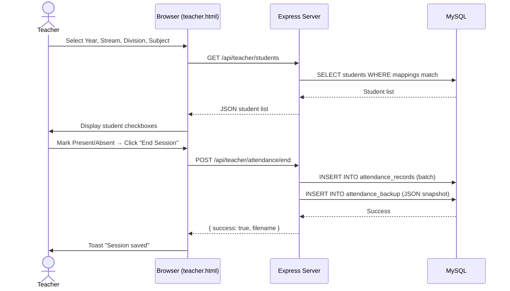
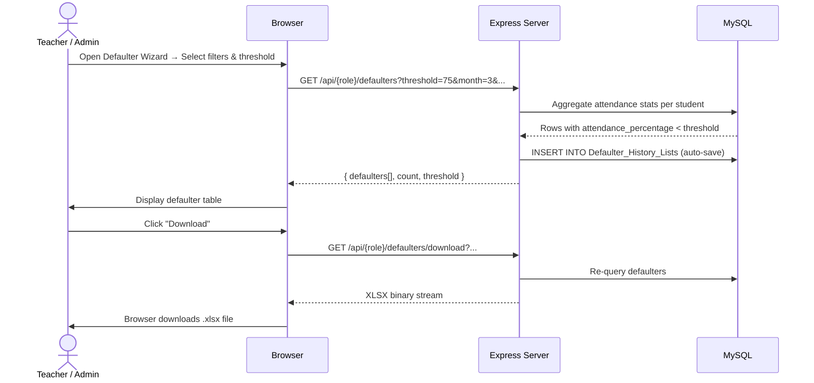
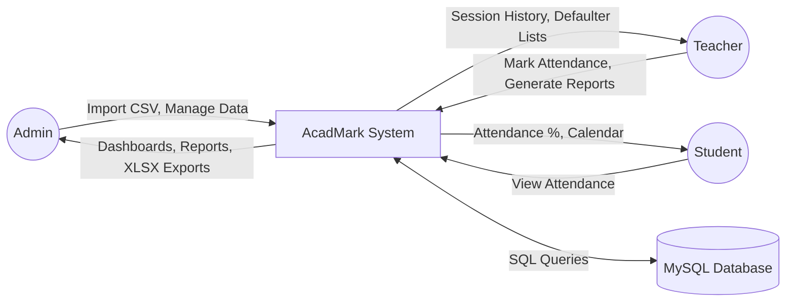
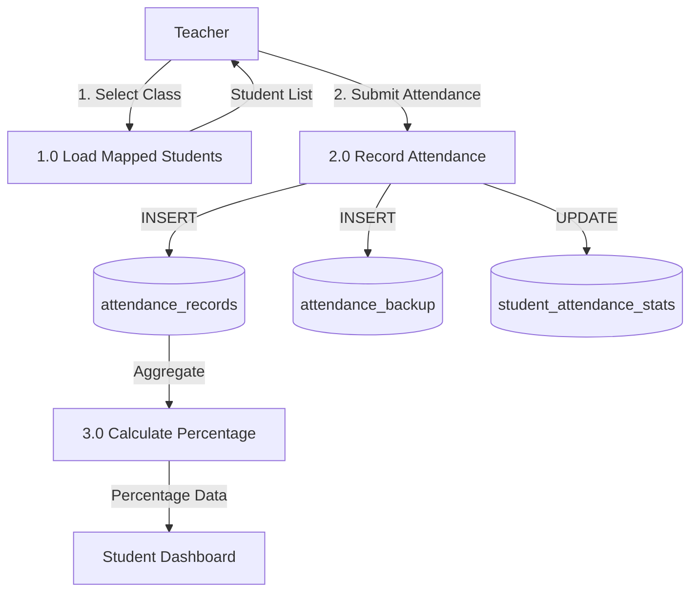

# Software Requirements Specification (SRS)

## AcadMark — Student Attendance Management Web Application

| Field                | Detail                                                                                                                                                  |
| -------------------- | ------------------------------------------------------------------------------------------------------------------------------------------------------- |
| **Document Version** | 1.0                                                                                                                                                     |
| **Date**             | March 2026                                                                                                                                              |
| **Project Title**    | AcadMark — Student Attendance Management System                                                                                                         |
| **Institution**      | Sheth N.K.T.T. College of Commerce & Sheth J.T.T. College of Arts (Autonomous), Thane                                                                   |
| **Team**             | Yash Mane (Project Lead), Shashikant Mane (Deployment & Documentation), Hinal Diwani (Frontend Developer), Mohammed Sirajuddin Khan (Backend Developer) |

---

## Table of Contents

1. [Introduction](#1-introduction)
2. [Overall Description](#2-overall-description)
3. [System Features & Functional Requirements](#3-system-features--functional-requirements)
4. [External Interface Requirements](#4-external-interface-requirements)
5. [Non-Functional Requirements](#5-non-functional-requirements)
6. [Use Case Diagrams](#6-use-case-diagrams)
7. [Data Flow Diagrams](#7-data-flow-diagrams)
8. [System Constraints](#8-system-constraints)
9. [Assumptions & Dependencies](#9-assumptions--dependencies)
10. [Appendices](#10-appendices)

---

## 1. Introduction

### 1.1 Purpose

This document specifies the software requirements for **AcadMark**, a web-based student attendance management system. It is intended for the development team, project evaluators, and college administration stakeholders.

### 1.2 Scope

AcadMark enables:

- **Faculty** to mark, view, and export attendance for their assigned classes and subjects.
- **Students** to view their own attendance percentage, calendar, and session history.
- **Administrators** to manage users, view institution-wide reports, generate defaulter lists, and export data.

### 1.3 Definitions & Acronyms

| Term | Definition                           |
| ---- | ------------------------------------ |
| SRS  | Software Requirements Specification  |
| CRUD | Create, Read, Update, Delete         |
| API  | Application Programming Interface    |
| SSE  | Server-Sent Events                   |
| CSV  | Comma-Separated Values               |
| XLSX | Microsoft Excel Open XML Spreadsheet |

### 1.4 References

- IEEE Std 830-1998 — Recommended Practice for Software Requirements Specifications
- Express.js Official Documentation — [https://expressjs.com](https://expressjs.com)
- MySQL 8.0 Reference Manual — [https://dev.mysql.com/doc/](https://dev.mysql.com/doc/)

### 1.5 Overview

The remainder of this document describes the system's overall context, detailed functional and non-functional requirements, use case diagrams, data flow diagrams, constraints, and assumptions.

---

## 2. Overall Description

### 2.1 Product Perspective

AcadMark is a standalone web application designed for a single college. It follows a classic three-tier architecture:

```
┌──────────────────┐     ┌─────────────────┐     ┌──────────────┐
│   Browser (UI)   │◄───►│  Express Server  │◄───►│   MySQL DB   │
│  HTML/CSS/JS     │     │  Node.js API     │     │  Relational  │
└──────────────────┘     └─────────────────┘     └──────────────┘
```

### 2.2 Product Functions (Summary)

| #   | Function                                            | Actors         |
| --- | --------------------------------------------------- | -------------- |
| F1  | Role-based authentication (Admin, Teacher, Student) | All            |
| F2  | Mark attendance by class, subject, and date         | Teacher        |
| F3  | View attendance calendar and percentage             | Student        |
| F4  | Generate and export defaulter lists (XLSX)          | Teacher, Admin |
| F5  | Import students/teachers via CSV                    | Admin          |
| F6  | View session history and export attendance records  | Teacher, Admin |
| F7  | Real-time dashboard with live statistics            | Admin          |
| F8  | Auto-map students to teachers based on assignments  | Admin          |

### 2.3 User Classes & Characteristics

| User Class          | Count (approx.) | Technical Level | Description                                     |
| ------------------- | --------------- | --------------- | ----------------------------------------------- |
| **Administrator**   | 1–3             | Moderate        | College office staff managing the system        |
| **Teacher/Faculty** | 5–50            | Low–Moderate    | Faculty marking attendance for assigned classes |
| **Student**         | 50–5000         | Low             | Students viewing their own attendance data      |

### 2.4 Operating Environment

- **Server**: Node.js v18+ on any OS (Windows, Linux, macOS)
- **Database**: MySQL 8.0+
- **Client**: Any modern web browser (Chrome 90+, Firefox 88+, Edge 90+, Safari 14+)
- **Network**: HTTP/HTTPS over LAN or Internet

### 2.5 Design & Implementation Constraints

- No frontend framework (React, Vue, etc.) — Vanilla JavaScript only.
- Session-based authentication (express-session with MySQL session store).
- Single-database deployment (no sharding or replication required).

---

## 3. System Features & Functional Requirements

### 3.1 Authentication Module

| ID         | Requirement                                                                                                            | Priority |
| ---------- | ---------------------------------------------------------------------------------------------------------------------- | -------- |
| FR-AUTH-01 | The system shall provide a login page with User ID and Password fields.                                                | High     |
| FR-AUTH-02 | The system shall authenticate users against the MySQL database using bcrypt-hashed passwords.                          | High     |
| FR-AUTH-03 | The system shall redirect users to role-specific dashboards (Admin, Teacher, Student) upon successful login.           | High     |
| FR-AUTH-04 | The system shall maintain session state using server-side sessions stored in MySQL.                                    | High     |
| FR-AUTH-05 | The system shall provide a logout endpoint that destroys the session and redirects to the login page.                  | High     |
| FR-AUTH-06 | The system shall return appropriate error messages for invalid credentials without revealing which field is incorrect. | Medium   |

### 3.2 Teacher — Attendance Marking

| ID        | Requirement                                                                                                   | Priority |
| --------- | ------------------------------------------------------------------------------------------------------------- | -------- |
| FR-ATT-01 | The teacher shall select Year, Stream, Semester, Division, and Subject before starting an attendance session. | High     |
| FR-ATT-02 | The system shall display all mapped students for the selected class configuration.                            | High     |
| FR-ATT-03 | The teacher shall mark each student as Present (P) or Absent (A).                                             | High     |
| FR-ATT-04 | The system shall save the attendance session with a unique session ID, date/time, and teacher reference.      | High     |
| FR-ATT-05 | The system shall create a backup record of each attendance session (JSON snapshot).                           | Medium   |
| FR-ATT-06 | The teacher shall export any attendance session as an XLSX file.                                              | Medium   |
| FR-ATT-07 | The system shall restrict teachers to only their assigned Year, Stream, Division, and Subjects.               | High     |

### 3.3 Teacher — Defaulter List Generation

| ID        | Requirement                                                                                                           | Priority |
| --------- | --------------------------------------------------------------------------------------------------------------------- | -------- |
| FR-DEF-01 | The teacher shall generate a defaulter list by selecting Year, Stream, Division, Month, and Attendance Threshold (%). | High     |
| FR-DEF-02 | The system shall calculate each student's attendance percentage for the selected filters.                             | High     |
| FR-DEF-03 | The teacher shall view defaulters in a table and export the list as XLSX.                                             | High     |
| FR-DEF-04 | Each viewed/exported defaulter list shall be automatically saved to the Defaulter History.                            | Medium   |
| FR-DEF-05 | The teacher shall view, download, and delete items from Defaulter History.                                            | Medium   |

### 3.4 Student — Attendance View

| ID        | Requirement                                                                                 | Priority |
| --------- | ------------------------------------------------------------------------------------------- | -------- |
| FR-STU-01 | The student shall view their overall attendance percentage on the dashboard.                | High     |
| FR-STU-02 | The student shall view a monthly attendance calendar with present/absent indicators.        | High     |
| FR-STU-03 | The student shall view a list of sessions they attended (present) and missed (absent).      | Medium   |
| FR-STU-04 | The system shall display the student's personal details (ID, Name, Year, Stream, Division). | Low      |

### 3.5 Admin — Dashboard & Reports

| ID        | Requirement                                                                                                     | Priority |
| --------- | --------------------------------------------------------------------------------------------------------------- | -------- |
| FR-ADM-01 | The admin dashboard shall display aggregate statistics: total students, teachers, streams, divisions, subjects. | High     |
| FR-ADM-02 | The admin shall view all teachers and their assignments in a modal table.                                       | High     |
| FR-ADM-03 | The admin shall view and filter students by Year, Stream, and Division.                                         | High     |
| FR-ADM-04 | The admin shall view attendance history (all session records) with View, Download, Delete actions.              | High     |
| FR-ADM-05 | The admin shall generate defaulter lists with the same wizard as teachers but without class restrictions.       | High     |
| FR-ADM-06 | The admin shall view, download, and delete items from Defaulter Lists History.                                  | Medium   |

### 3.6 Admin — Data Import & Management

| ID        | Requirement                                                                                             | Priority |
| --------- | ------------------------------------------------------------------------------------------------------- | -------- |
| FR-IMP-01 | The admin shall import students from a CSV/XLSX file with a preview step before confirmation.           | High     |
| FR-IMP-02 | The admin shall import teachers from a CSV/XLSX file with a preview step before confirmation.           | High     |
| FR-IMP-03 | The admin shall trigger auto-mapping of students to teachers based on Year/Stream/Division assignments. | Medium   |
| FR-IMP-04 | The admin shall download CSV/XLSX templates for student and teacher imports.                            | Low      |
| FR-IMP-05 | The admin shall clear all attendance history.                                                           | Medium   |
| FR-IMP-06 | The admin shall delete all data (full system reset).                                                    | Low      |

### 3.7 Real-Time Updates

| ID       | Requirement                                                                                               | Priority |
| -------- | --------------------------------------------------------------------------------------------------------- | -------- |
| FR-RT-01 | The system shall provide Server-Sent Events (SSE) for live dashboard updates.                             | Medium   |
| FR-RT-02 | Connected clients shall receive notifications when attendance is marked or defaulter lists are generated. | Medium   |

---

## 4. External Interface Requirements

### 4.1 User Interfaces

| Page              | URL Pattern | Description                                                   |
| ----------------- | ----------- | ------------------------------------------------------------- |
| Login             | `/`         | Credentials form with role-based redirect                     |
| Admin Dashboard   | `/admin`    | Statistics cards, import, reports, defaulter wizard           |
| Teacher Dashboard | `/teacher`  | Class selector, attendance marking, history, defaulter wizard |
| Student Dashboard | `/student`  | Attendance percentage, calendar, session lists                |

### 4.2 Hardware Interfaces

No special hardware required. The application runs on standard server hardware or cloud VMs.

### 4.3 Software Interfaces

| Component | Interface                                       |
| --------- | ----------------------------------------------- |
| MySQL 8.0 | TCP port 3306, mysql2 driver                    |
| Node.js   | HTTP server on configurable port (default 3000) |
| Browser   | HTTP/1.1, ES6+ JavaScript                       |

### 4.4 Communication Interfaces

- **HTTP REST API** for all client-server communication.
- **SSE (Server-Sent Events)** for real-time push notifications.
- **JSON** as the primary data exchange format.
- **Multipart form-data** for file uploads (CSV/XLSX import).

---

## 5. Non-Functional Requirements

### 5.1 Performance

| ID          | Requirement                                                                    |
| ----------- | ------------------------------------------------------------------------------ |
| NFR-PERF-01 | API endpoints shall respond within 500ms for typical queries (≤200 rows).      |
| NFR-PERF-02 | The login page shall load within 2 seconds on a standard broadband connection. |
| NFR-PERF-03 | XLSX export shall complete within 5 seconds for lists up to 500 students.      |

### 5.2 Security

| ID         | Requirement                                                                       |
| ---------- | --------------------------------------------------------------------------------- |
| NFR-SEC-01 | Passwords shall be hashed using bcrypt with a cost factor ≥ 10.                   |
| NFR-SEC-02 | All database queries shall use parameterized statements to prevent SQL injection. |
| NFR-SEC-03 | Role-based middleware shall enforce access control on every protected route.      |
| NFR-SEC-04 | Session cookies shall be HTTP-only and have a configurable expiry.                |

### 5.3 Reliability & Availability

| ID         | Requirement                                                                        |
| ---------- | ---------------------------------------------------------------------------------- |
| NFR-REL-01 | The system shall gracefully handle database connection failures with retry logic.  |
| NFR-REL-02 | Attendance backup records shall persist even if the main session table is cleared. |

### 5.4 Usability

| ID         | Requirement                                                                             |
| ---------- | --------------------------------------------------------------------------------------- |
| NFR-USE-01 | The UI shall be responsive and usable on screens ≥ 360px wide.                          |
| NFR-USE-02 | All user actions shall provide visual feedback (loading spinners, toast notifications). |
| NFR-USE-03 | Form validation shall occur on both client and server sides.                            |

### 5.5 Maintainability

| ID         | Requirement                                                                             |
| ---------- | --------------------------------------------------------------------------------------- |
| NFR-MNT-01 | Source code shall follow ESM (ES Modules) import/export syntax.                         |
| NFR-MNT-02 | Controllers, routes, services, and middleware shall be separated into distinct modules. |

---

## 6. Use Case Diagrams

### 6.1 Overall System Use Cases

```mermaid
graph TB
    subgraph "AcadMark System"
        UC1["Login / Logout"]
        UC2["Mark Attendance"]
        UC3["View Attendance History"]
        UC4["Export Attendance (XLSX)"]
        UC5["Generate Defaulter List"]
        UC6["View Defaulter History"]
        UC7["Download Defaulter List"]
        UC8["Import Students (CSV)"]
        UC9["Import Teachers (CSV)"]
        UC10["View Dashboard Stats"]
        UC11["View Attendance Calendar"]
        UC12["View Present/Absent Sessions"]
        UC13["Auto-Map Students"]
        UC14["Clear / Delete Data"]
    end

    Admin(("👤 Admin"))
    Teacher(("👤 Teacher"))
    Student(("👤 Student"))

    Admin --> UC1
    Admin --> UC5
    Admin --> UC6
    Admin --> UC7
    Admin --> UC8
    Admin --> UC9
    Admin --> UC10
    Admin --> UC3
    Admin --> UC4
    Admin --> UC13
    Admin --> UC14

    Teacher --> UC1
    Teacher --> UC2
    Teacher --> UC3
    Teacher --> UC4
    Teacher --> UC5
    Teacher --> UC6
    Teacher --> UC7

    Student --> UC1
    Student --> UC11
    Student --> UC12
```



### 6.2 Attendance Marking Use Case (Detailed)



### 6.3 Defaulter Generation Use Case



---

## 7. Data Flow Diagrams

### 7.1 Context Diagram (Level 0)



### 7.2 Level 1 DFD — Attendance Flow



---

## 8. System Constraints

| #   | Constraint                                                            |
| --- | --------------------------------------------------------------------- |
| C1  | The application must use Vanilla JavaScript (no React, Angular, Vue). |
| C2  | The database must be MySQL (not MongoDB or PostgreSQL).               |
| C3  | The server framework must be Express.js on Node.js.                   |
| C4  | The project must be deployable on a single machine for demonstration. |
| C5  | File uploads are limited to CSV and XLSX formats.                     |
| C6  | The system is designed for a single institution (no multi-tenancy).   |

---

## 9. Assumptions & Dependencies

### 9.1 Assumptions

1. The college provides a MySQL server accessible to the Node.js application.
2. Teachers are pre-assigned to specific Year/Stream/Division/Subject combinations via the import process.
3. Students are pre-enrolled and mapped to their respective classes before attendance marking begins.
4. A modern web browser with JavaScript enabled is available to all users.

### 9.2 Dependencies

| Dependency      | Version | Purpose                   |
| --------------- | ------- | ------------------------- |
| Node.js         | ≥ 18.0  | Server runtime            |
| Express.js      | ^4.18   | HTTP framework            |
| mysql2          | ^3.0    | MySQL driver              |
| exceljs         | ^4.0    | XLSX generation           |
| bcrypt          | ^5.0    | Password hashing          |
| express-session | ^1.17   | Session management        |
| multer          | ^1.4    | File upload handling      |
| dotenv          | ^16.0   | Environment configuration |
| nodemon         | ^3.0    | Development auto-restart  |

---

## 10. Appendices

### Appendix A — Glossary

| Term      | Definition                                                                       |
| --------- | -------------------------------------------------------------------------------- |
| Defaulter | A student whose attendance percentage falls below a defined threshold            |
| Session   | A single instance of attendance marking for a class on a specific date/time      |
| Mapping   | The association of a student to a teacher's class assignment                     |
| Threshold | The minimum attendance percentage below which a student is marked as a defaulter |

### Appendix B — Team Responsibilities

| Member                       | Role                       | Responsibilities                                              |
| ---------------------------- | -------------------------- | ------------------------------------------------------------- |
| **Yash Mane**                | Project Lead               | Requirement analysis, project coordination, progress tracking |
| **Shashikant Mane**          | Deployment & Documentation | Server setup, deployment, documentation, testing              |
| **Hinal Diwani**             | Frontend Developer         | UI/UX design, HTML/CSS, client-side JavaScript                |
| **Mohammed Sirajuddin Khan** | Backend Developer          | Express.js APIs, MySQL queries, business logic, services      |

---

_Document prepared by **Shashikant Mane** (Deployment & Documentation) under the supervision of **Yash Mane** (Project Lead)._
