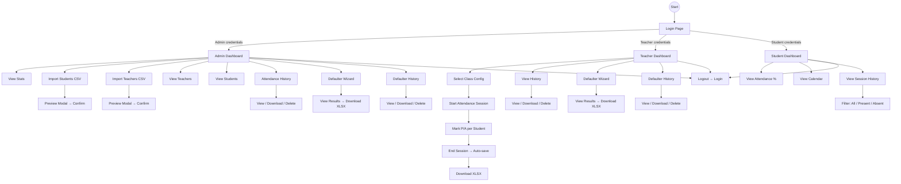

# UI Wireframes & Screen Designs — AcadMark

## Student Attendance Management System

---

## Table of Contents

1. [Design Philosophy](#1-design-philosophy)
2. [Colour Palette & Typography](#2-colour-palette--typography)
3. [Screen 1 — Login Page](#3-screen-1--login-page)
4. [Screen 2 — Admin Dashboard](#4-screen-2--admin-dashboard)
5. [Screen 3 — Admin Import Wizard](#5-screen-3--admin-import-wizard)
6. [Screen 4 — Admin Attendance History](#6-screen-4--admin-attendance-history)
7. [Screen 5 — Teacher Dashboard](#7-screen-5--teacher-dashboard)
8. [Screen 6 — Teacher Attendance Marking](#8-screen-6--teacher-attendance-marking)
9. [Screen 7 — Teacher Defaulter Wizard](#9-screen-7--teacher-defaulter-wizard)
10. [Screen 8 — Student Dashboard](#10-screen-8--student-dashboard)
11. [User Flow Diagram](#11-user-flow-diagram)
12. [Responsive Design Notes](#12-responsive-design-notes)

---

## 1. Design Philosophy

AcadMark uses a **clean, card-based UI** built entirely with Vanilla CSS (no Bootstrap or Tailwind). The design priorities are:

- **Clarity** — Large stat cards, distinct colour-coded buttons, simple navigation.
- **Efficiency** — Minimal clicks to perform core tasks (mark attendance in 3 steps).
- **Accessibility** — Readable font sizes, sufficient colour contrast, keyboard-navigable forms.
- **Consistency** — Unified colour scheme across all four dashboards.

---

## 2. Colour Palette & Typography

### 2.1 Primary Colours

| Colour           | Hex       | Usage                              |
| ---------------- | --------- | ---------------------------------- |
| Primary Blue     | `#4A90D9` | Headers, primary buttons, links    |
| Success Green    | `#27AE60` | Present indicators, success toasts |
| Danger Red       | `#E74C3C` | Absent indicators, delete actions  |
| Warning Yellow   | `#F39C12` | Threshold alerts, pending states   |
| Dark Text        | `#2C3E50` | Body text, headings                |
| Light Background | `#F7F9FC` | Page background                    |
| Card White       | `#FFFFFF` | Card surfaces                      |
| Border Grey      | `#E0E0E0` | Card borders, dividers             |

### 2.2 Typography

```css
/* Primary Font Stack */
font-family: "Segoe UI", Tahoma, Geneva, Verdana, sans-serif;

/* Heading Scale */
h1 {
  font-size: 1.8rem;
  font-weight: 700;
}
h2 {
  font-size: 1.4rem;
  font-weight: 600;
}
h3 {
  font-size: 1.2rem;
  font-weight: 600;
}

/* Body */
body {
  font-size: 0.95rem;
  line-height: 1.5;
}
```

### 2.3 Button Styles

```css
/* Primary Action */
.btn-primary {
  background: #4a90d9;
  color: #fff;
  border-radius: 6px;
}

/* Success / Present */
.btn-success {
  background: #27ae60;
  color: #fff;
}

/* Danger / Delete */
.btn-danger {
  background: #e74c3c;
  color: #fff;
}

/* Secondary / Cancel */
.btn-secondary {
  background: #95a5a6;
  color: #fff;
}

/* Download */
.btn-download {
  background: #3498db;
  color: #fff;
}
```

---

## 3. Screen 1 — Login Page

### Wireframe

```
┌─────────────────────────────────────────────────────────────┐
│                         AcadMark                            │
│                 Student Attendance System                    │
│                                                             │
│              ┌─────────────────────────────┐                │
│              │         🔐 Login            │                │
│              │                             │                │
│              │  User ID                    │                │
│              │  ┌─────────────────────┐    │                │
│              │  │ e.g. T001           │    │                │
│              │  └─────────────────────┘    │                │
│              │                             │                │
│              │  Password                   │                │
│              │  ┌─────────────────────┐    │                │
│              │  │ ••••••••            │    │                │
│              │  └─────────────────────┘    │                │
│              │                             │                │
│              │  ┌─────────────────────┐    │                │
│              │  │     🔵 Login        │    │                │
│              │  └─────────────────────┘    │                │
│              │                             │                │
│              └─────────────────────────────┘                │
│                                                             │
└─────────────────────────────────────────────────────────────┘
```

### Key Elements

| Element        | Type                  | Notes                                       |
| -------------- | --------------------- | ------------------------------------------- |
| Logo/Title     | `<h1>`                | "AcadMark" centred at top                   |
| User ID field  | `<input text>`        | Accepts teacher_id, student_id, or "admin"  |
| Password field | `<input password>`    | Masked input                                |
| Login button   | `<button>`            | Primary blue, full width within card        |
| Error toast    | `<div class="toast">` | Appears below button on invalid credentials |

<!-- Screenshot placeholder -->

> **📸 Screenshot**: `screenshots/login.png`

---

## 4. Screen 2 — Admin Dashboard

### Wireframe

```
┌─────────────────────────────────────────────────────────────┐
│  🏛️ Admin Dashboard                           [Logout]      │
├─────────────────────────────────────────────────────────────┤
│                                                             │
│  ┌──────────┐  ┌──────────┐  ┌──────────┐  ┌──────────┐   │
│  │ Students │  │ Teachers │  │ Streams  │  │ Subjects │   │
│  │    90    │  │    5     │  │    1     │  │    6     │   │
│  └──────────┘  └──────────┘  └──────────┘  └──────────┘   │
│                                                             │
│  ┌──────────────────────┐  ┌──────────────────────────┐     │
│  │ 📂 Import Students  │  │ 📂 Import Teachers       │     │
│  │ [Choose File] [Upload│  │ [Choose File] [Upload]   │     │
│  └──────────────────────┘  └──────────────────────────┘     │
│                                                             │
│  ┌───────────────────────────────────────────────────────┐  │
│  │  📋 Tab: Teachers | Students | Attendance History |   │  │
│  │        Defaulter Wizard | Defaulter History           │  │
│  ├───────────────────────────────────────────────────────┤  │
│  │  (Tab content rendered dynamically)                   │  │
│  │  ┌─────────────────────────────────────────────────┐  │  │
│  │  │ Table rows with View | Download | Delete btns   │  │  │
│  │  └─────────────────────────────────────────────────┘  │  │
│  └───────────────────────────────────────────────────────┘  │
│                                                             │
└─────────────────────────────────────────────────────────────┘
```

### Key Elements

| Element             | Description                                                                         |
| ------------------- | ----------------------------------------------------------------------------------- |
| Stats Cards (4)     | Display total students, unique teachers, streams, subjects                          |
| Import Sections (2) | File upload for students CSV and teachers CSV with preview modal                    |
| Tab Navigation      | 5 tabs: Teachers, Students, Attendance History, Defaulter Wizard, Defaulter History |
| Action Buttons      | View (green), Download (blue), Delete (red) per row                                 |
| Auto-Map Button     | Triggers student–teacher mapping                                                    |
| Danger Zone         | Clear History, Delete All Data (confirmation required)                              |

> **📸 Screenshot**: `screenshots/admin_dashboard.png`

---

## 5. Screen 3 — Admin Import Wizard

### Wireframe

```
┌─────────────────────────────────────────────────────────────┐
│  Import Students                                [×]          │
├─────────────────────────────────────────────────────────────┤
│                                                             │
│  ┌─────────────────────────────────────────────────────┐   │
│  │  📄 Preview (first 10 rows)                         │   │
│  ├──────────┬──────────────┬────┬────┬────────┬──────┤   │
│  │ ID       │ Name         │Year│Strm│Division│RollNo│   │
│  ├──────────┼──────────────┼────┼────┼────────┼──────┤   │
│  │TY-BSCIT..│ Student 1    │ TY │BSC.│   A    │  1   │   │
│  │TY-BSCIT..│ Student 2    │ TY │BSC.│   A    │  2   │   │
│  │  ...     │  ...         │ .. │ .. │  ...   │ ...  │   │
│  └──────────┴──────────────┴────┴────┴────────┴──────┘   │
│                                                             │
│  Total rows: 90                                             │
│                                                             │
│  ┌──────────────┐  ┌─────────────────┐                     │
│  │ ❌ Cancel    │  │ ✅ Confirm Imprt │                     │
│  └──────────────┘  └─────────────────┘                     │
│                                                             │
└─────────────────────────────────────────────────────────────┘
```

> **📸 Screenshot**: `screenshots/admin_import_preview.png`

---

## 6. Screen 4 — Admin Attendance History

### Wireframe

```
┌─────────────────────────────────────────────────────────────┐
│  Attendance History (All Records)                           │
├────┬───────────┬────────┬────┬────┬────────┬───────────────┤
│ #  │ Filename  │Teacher │Year│Div │ Date   │ Actions       │
├────┼───────────┼────────┼────┼────┼────────┼───────────────┤
│ 1  │ att_TY_A..│ T001   │ TY │ A  │ 15 Mar │ 👁 📥 🗑     │
│ 2  │ att_TY_B..│ T002   │ TY │ B  │ 15 Mar │ 👁 📥 🗑     │
│ 3  │ att_TY_C..│ T003   │ TY │ C  │ 14 Mar │ 👁 📥 🗑     │
└────┴───────────┴────────┴────┴────┴────────┴───────────────┘
│                                                             │
│  👁 = View (modal)   📥 = Download (XLSX)   🗑 = Delete    │
│                                                             │
│  ⚠️ [Clear All History]                                     │
└─────────────────────────────────────────────────────────────┘
```

> **📸 Screenshot**: `screenshots/admin_attendance_history.png`

---

## 7. Screen 5 — Teacher Dashboard

### Wireframe

```
┌─────────────────────────────────────────────────────────────┐
│  👨‍🏫 Teacher Dashboard                        [Logout]       │
├─────────────────────────────────────────────────────────────┤
│                                                             │
│  Welcome, Prof. [Name]                                      │
│  Subjects: DBMS, Software Engineering                       │
│                                                             │
│  ┌──────────┐  ┌──────────┐  ┌──────────┐                  │
│  │ Classes  │  │ Students │  │ Subjects │                  │
│  │    2     │  │   60     │  │    2     │                  │
│  └──────────┘  └──────────┘  └──────────┘                  │
│                                                             │
│  ┌───────────────────────────────────────────────────────┐  │
│  │  📋 Tabs: Mark Attendance | History | Defaulter       │  │
│  │           Wizard | Defaulter History                  │  │
│  ├───────────────────────────────────────────────────────┤  │
│  │  (Active tab content)                                 │  │
│  └───────────────────────────────────────────────────────┘  │
│                                                             │
└─────────────────────────────────────────────────────────────┘
```

> **📸 Screenshot**: `screenshots/teacher_dashboard.png`

---

## 8. Screen 6 — Teacher Attendance Marking

### Wireframe

```
┌─────────────────────────────────────────────────────────────┐
│  Mark Attendance                                            │
├─────────────────────────────────────────────────────────────┤
│                                                             │
│  Year: [TY ▼]  Stream: [BSCIT ▼]  Division: [A ▼]         │
│  Subject: [DBMS ▼]   Semester: [5 ▼]                       │
│                                                             │
│  ┌──────────────┐                                           │
│  │ Start Session │                                          │
│  └──────────────┘                                           │
│                                                             │
│  ┌────┬──────────────┬──────────────┬───────────────────┐   │
│  │ #  │ Student ID   │ Name         │ Status            │   │
│  ├────┼──────────────┼──────────────┼───────────────────┤   │
│  │ 1  │ TY-BSCIT-A-01│ Student 1   │ ✅ Present  ☐ Abs │   │
│  │ 2  │ TY-BSCIT-A-02│ Student 2   │ ☐ Present  ✅ Abs │   │
│  │ 3  │ TY-BSCIT-A-03│ Student 3   │ ✅ Present  ☐ Abs │   │
│  │ .. │ ...          │ ...          │ ...               │   │
│  │ 30 │ TY-BSCIT-A-30│ Student 30  │ ✅ Present  ☐ Abs │   │
│  └────┴──────────────┴──────────────┴───────────────────┘   │
│                                                             │
│  Present: 25  |  Absent: 5  |  Total: 30                   │
│                                                             │
│  ┌─────────────────┐  ┌──────────────────┐                  │
│  │ 📥 Download     │  │ ✅ End Session   │                  │
│  └─────────────────┘  └──────────────────┘                  │
│                                                             │
└─────────────────────────────────────────────────────────────┘
```

> **📸 Screenshot**: `screenshots/teacher_attendance_marking.png`

---

## 9. Screen 7 — Teacher Defaulter Wizard

### Wireframe

```
┌─────────────────────────────────────────────────────────────┐
│  Generate Defaulter List                                    │
├─────────────────────────────────────────────────────────────┤
│                                                             │
│  Filters:                                                   │
│  Year: [TY ▼]  Stream: [BSCIT ▼]  Division: [A ▼]         │
│  Month: [March ▼]   Threshold: [75 ▼] %                    │
│                                                             │
│  ┌────────────────────┐  ┌────────────────────┐             │
│  │ 👁 View Defaulters │  │ 📥 Download        │             │
│  └────────────────────┘  └────────────────────┘             │
│                                                             │
│  ┌─ Results ─────────────────────────────────────────────┐  │
│  │  Students below 75% threshold: 8                      │  │
│  ├────┬──────────────┬──────────────┬───────┬──────────┤  │
│  │ #  │ Student ID   │ Name         │ Attd% │ Sessions │  │
│  ├────┼──────────────┼──────────────┼───────┼──────────┤  │
│  │ 1  │ TY-BSCIT-A-05│ Student 5   │ 45.0% │  9 / 20  │  │
│  │ 2  │ TY-BSCIT-A-12│ Student 12  │ 55.0% │ 11 / 20  │  │
│  │ 3  │ TY-BSCIT-A-18│ Student 18  │ 60.0% │ 12 / 20  │  │
│  │ .. │ ...          │ ...          │ ...   │ ...      │  │
│  └────┴──────────────┴──────────────┴───────┴──────────┘  │
│  └───────────────────────────────────────────────────────┘  │
│                                                             │
└─────────────────────────────────────────────────────────────┘
```

> **📸 Screenshot**: `screenshots/teacher_defaulter_wizard.png`

---

## 10. Screen 8 — Student Dashboard

### Wireframe

```
┌─────────────────────────────────────────────────────────────┐
│  🎓 Student Dashboard                         [Logout]      │
├─────────────────────────────────────────────────────────────┤
│                                                             │
│  Student: Student Name (TY-BSCIT-A-01)                      │
│  Year: TY  |  Stream: BSCIT  |  Division: A  |  Roll: 1    │
│                                                             │
│  ┌──────────────────┐  ┌──────────────────┐                 │
│  │  Overall Attd%   │  │  Total Sessions  │                 │
│  │     82.5%        │  │       40         │                 │
│  │  ████████░░      │  │                  │                 │
│  └──────────────────┘  └──────────────────┘                 │
│                                                             │
│  ┌── Attendance Calendar (March 2025) ───────────────────┐  │
│  │  Mon  Tue  Wed  Thu  Fri  Sat  Sun                    │  │
│  │                            1✅  2                      │  │
│  │  3✅  4❌  5✅  6✅  7✅  8    9                      │  │
│  │  10✅ 11✅ 12❌ 13✅ 14✅ 15   16                     │  │
│  │  17✅ 18✅ 19✅ 20❌ 21✅ 22   23                     │  │
│  │  24✅ 25✅ 26✅ 27✅ 28✅ 29   30                     │  │
│  │  31✅                                                 │  │
│  └───────────────────────────────────────────────────────┘  │
│                                                             │
│  ┌── Session History ────────────────────────────────────┐  │
│  │  📋 Tabs: All Sessions | Present | Absent            │  │
│  ├───────────────────────────────────────────────────────┤  │
│  │  Date       │ Subject │ Teacher │ Status              │  │
│  │  15 Mar     │ DBMS    │ T001    │ ✅ Present          │  │
│  │  14 Mar     │ SE      │ T001    │ ❌ Absent           │  │
│  │  13 Mar     │ DBMS    │ T001    │ ✅ Present          │  │
│  └───────────────────────────────────────────────────────┘  │
│                                                             │
└─────────────────────────────────────────────────────────────┘
```

> **📸 Screenshot**: `screenshots/student_dashboard.png`

---

## 11. User Flow Diagram



---

## 12. Responsive Design Notes

### Breakpoints

```css
/* Mobile first */
@media (max-width: 576px) {
  /* Stack cards vertically, full-width tables */
}
@media (max-width: 768px) {
  /* 2-column card grid, horizontal scroll tables */
}
@media (max-width: 1024px) {
  /* 3-column card grid */
}
@media (min-width: 1025px) {
  /* 4-column card grid, full table display */
}
```

### Mobile Considerations

| Component             | Desktop              | Mobile                        |
| --------------------- | -------------------- | ----------------------------- |
| Stat cards            | 4 per row            | 2 per row, stacked            |
| Data tables           | Full width           | Horizontal scroll wrapper     |
| Modals                | Centred overlay      | Full-screen overlay           |
| Tab navigation        | Horizontal tabs      | Scrollable tab bar            |
| Attendance checkboxes | Side-by-side buttons | Full-width toggle             |
| Calendar              | 7-column grid        | 7-column grid (smaller cells) |

### CSS Architecture

```
public/css/style.css
├── CSS Variables (colour scheme, spacing)
├── Base Reset & Typography
├── Layout (header, main, sidebar)
├── Components
│   ├── Cards (.stat-card, .info-card)
│   ├── Tables (.data-table, .history-table)
│   ├── Buttons (.btn-primary, .btn-danger, .btn-download)
│   ├── Forms (.form-group, .select-wrapper)
│   ├── Modals (.modal-overlay, .modal-content)
│   ├── Tabs (.tab-nav, .tab-content)
│   └── Toasts (.toast, .toast-success, .toast-error)
├── Page-specific overrides
└── Responsive media queries
```

---

_Wireframes and UI design by **Hinal Diwani** (Frontend Developer). Reviewed by **Yash Mane** (Project Lead)._
